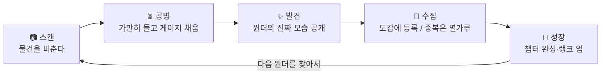

# 📜 HISTORY — Wonder Scanner 4시간 스프린트 기록

> 이 문서는 개발 중 README에 있던 **진행 현황 보드**를 옮겨 온 것입니다.
> 프로젝트 소개는 [README.md](README.md)를 보세요.

## 0. 한 줄 요약

Gemini 브레인스토밍의 아이디어 3번 **"AI 매직 렌즈: 일상의 놀라운 재발견"**(웹캠 + 온디바이스 사물 인식 + 유머러스 재해석 카드)을
**수집형 게임**으로 확장했다. 게임 요소(코어루프·밸런스·서사·연출)를 붙이고, 정적 웹으로 Vercel에 배포했다.

- 라이브: https://wonderscanner.vercel.app
- 저장소: https://github.com/akillness/wonder_scanner
- 결과: 80종 원더 / 4단계 희귀도 / 6챕터 / 10랭크 / 카드 공유 / 100% 브라우저 추론

## 1. 원안 → 게임으로 바꾼 것

| 원안 (Gemini 아이디어 3) | 게임화 결정 | 이유 |
|---|---|---|
| 사물 비추면 엉뚱한 수식어 카드 1장 | **80종 전부에 이름·설정·희귀도·챕터 부여** → 도감 | "한 번 웃고 끝"을 "다 모으고 싶다"로 바꾸는 핵심 |
| 즉시 결과 | **공명 게이지**(1.5~3초 유지) | 스캔에 "실력"과 긴장감 부여, 오탐도 걸러짐 |
| 없음 | **희귀도 = 실생활 조우 확률** | 책상 물건은 일반, 기린·비행기는 전설. 현실이 곧 드롭 테이블 |
| 없음 | **변이체(프리즘) 4~10%** | 같은 컵을 다시 찍어도 기대감 유지 |
| 없음 | **별가루 + 15초 쿨다운** | 중복이 헛수고가 아니되, 연타 파밍은 차단 |
| 없음 | **루페(Lupe) 캐릭터 + 챕터 스토리 + 엔딩** | 수집 목표를 "80개"가 아니라 "이 방의 10개"로 쪼개고 의미 부여 |
| 카드 생성 (html2canvas) | Canvas 2D 직접 렌더 → PNG 저장/공유 | 의존성 0, 카드 디자인 완전 제어 |
| TF.js Coco-SSD CDN | npm 번들 + 별도 청크(`tf-*.js`) | 캐시 효율, Vite 트리쉐이킹 |

## 2. 타임라인 (실제 커밋 시각 기준)

```mermaid
gantt
    title 실제 진행 (2026-09-23, 커밋 시각)
    dateFormat  HH:mm
    axisFormat  %H:%M
    section 기획·셋업
    P0 게임 디자인 + P1 Vite/TF.js 셋업      :done, p1, 15:40, 15:56
    section 구현
    P2 80 원더·밸런스·저장·서사 데이터        :done, p2, 15:56, 15:57
    P3~P5 스캐너·화면 4종·연출·카드           :done, p3, 15:57, 16:01
    section 검증·배포
    P6 브라우저 QA(Chrome DevTools) + 수정    :done, p6, 16:01, 16:07
    P7 Vercel 프로덕션 배포 + Git 푸시         :done, p7, 16:07, 16:12
    P8 README 소개 + HISTORY 작성             :done, p8, 16:12, 16:20
```

| 커밋 | 시각 | 내용 |
|---|---|---|
| `c29fd66` | 15:40 | Initial commit (빈 저장소) |
| `0abaf56` | 15:56 | P0/P1: 게임 디자인 보드 + Vite/TF.js 스캐폴드 |
| `9920e37` | 15:57 | P2: 80 원더, 희귀도/챕터, 밸런스 곡선, 저장 상태, 루페 대사 |
| `2955fb8` | 16:01 | P3–P5: 스캐너, 화면 4종, 공명 루프, FX/오디오, 공유 카드 |
| `02ec778` | 16:07 | P6: 브라우저 QA 수정 2건 + 스크린샷 |
| (이 커밋) | — | P7/P8: 배포 URL·QR, README 소개, HISTORY |

## 3. 단계별 체크리스트 (최종)

| 단계 | 내용 | 상태 |
|---|---|---|
| P0 | 게임 디자인 (코어루프 / 밸런스 / 서사) | ✅ |
| P1 | Vite + TF.js / COCO-SSD / canvas-confetti | ✅ |
| P2 | 80종 원더, 희귀도 4단계(24/26/20/10), 6챕터(10/21/15/13/11/10), XP 곡선 10단계 | ✅ |
| P3 | 카메라 스트림 + 온디바이스 탐지 + 공명 게이지 + 사진 업로드 폴백 | ✅ |
| P4 | 타이틀 → 스캔 → 발견 → 도감 (+ 상세 모달) | ✅ |
| P5 | 희귀도별 파티클, 플래시/글리치/셰이크/슬로모, Web Audio 합성음, 카드 PNG 저장·공유 | ✅ |
| P6 | Chrome DevTools로 390×844 모바일 뷰포트 QA, 빌드 통과 | ✅ |
| P7 | `vercel --prod` → https://wonderscanner.vercel.app, `git push origin main` | ✅ |
| P8 | README를 소개 문서로 교체, HISTORY.md 분리 | ✅ |

## 4. 설계 결정 (ADR-lite)

1. **Vanilla JS + 순수 CSS** (React/Tailwind 대신) — 화면 4개, 상태 1개. 프레임워크 셋업 시간이 오히려 손해. 애니메이션은 CSS keyframes로 충분.
2. **`lite_mobilenet_v2`** — COCO-SSD 3종 중 가장 가볍고 모바일에서 실시간. 정확도 손실은 "공명 게이지 유지"가 흡수.
3. **타깃 선택 = 신뢰도 0.7 + 화면 점유율 0.3** — 배경의 작은 물체 대신 "의도적으로 가까이 비춘 것"을 고르게.
4. **localStorage 단일 키** — Supabase 랭킹은 스코프 밖. 스키마는 `state.js` 상단 주석에 고정.
5. **Web Audio 합성음** — 오디오 에셋 0개, 로딩 0ms. 게이지 진행도에 따라 틱 피치·간격이 변해 "차오르는" 느낌.
6. **밸런스 상수 단일 파일** — `balance.js`만 고치면 전체 난이도 조정. 튜닝을 코드 리뷰 없이 가능하게.
7. **카드 공유** — 터치 기기(`pointer: coarse`)만 Web Share, 데스크톱은 즉시 다운로드 (QA에서 발견한 데스크톱 공유 시트 행 방지).

## 5. QA 로그 (Chrome DevTools MCP, 390×844)

| 시나리오 | 방법 | 결과 |
|---|---|---|
| 타이틀 렌더 / 루페 타이핑 | 스크린샷 | ✅ 콘솔 에러 0 |
| 모델 로드 | 스캔 진입 | ✅ WebGL 백엔드, 수 초 내 완료 |
| 카메라 거부 → 사진 폴백 | `getUserMedia` reject 주입 | ✅ 폴백 화면 + 파일 선택 |
| 신규 발견 (dog, 97%) | 사진 업로드 | ✅ NEW! 스탬프, 희귀, +40 XP +20 별가루, 루페 대사 |
| localStorage 저장 | 스크립트 조회 | ✅ 스키마 일치, 리로드 후 1/80 유지 |
| 도감 / 챕터 탭 / 상세 모달 | 클릭 | ✅ 잠긴 슬롯 실루엣, 소유 슬롯 발광 |
| 중복 발견 (dog ×2, ×3) | 재업로드 | ✅ ×n 스탬프, +8 XP +6 별가루, 중복 대사 |
| 쿨다운 | 모듈 직접 검증 | ✅ 직후 재스캔 `ok:false, remain 15000ms` |
| 랭크 업 (XP 56 ≥ 50) | 세 번째 스캔 | ✅ 「렌즈 수습생」 토스트 |
| 다른 클래스 (laptop, 95%) | 사진 업로드 | ✅ 신규 일반 원더 |
| 카드 PNG 저장 | 클릭 | ✅ "저장됨" (수정 후) |
| 프로덕션 빌드 | `vite build` | ✅ index 21KB gz / tf 274KB gz / css 3KB gz |

**발견·수정한 버그**
1. 카메라 권한 대기 중 상태 오버레이가 하단 컨트롤을 덮어 사진 폴백에 접근 불가 → `.scan .bottom` z-index 상향.
2. 데스크톱 Chrome에서 `navigator.share()`가 시스템 다이얼로그를 기다리며 무한 대기 → 터치 기기에서만 공유, 그 외 즉시 다운로드.

**미검증 항목(환경 제약)**: 실제 카메라 스트림에서의 공명 루프는 헤드리스 브라우저에 카메라가 없어 코드 리뷰와 사진 경로로만 검증. 실기기(iOS Safari / Android Chrome) 확인 권장.

## 6. 배포 기록

| 항목 | 값 |
|---|---|
| Vercel 프로젝트 | `wonder_scanner` (akillness-projects) |
| 프로덕션 | https://wonderscanner.vercel.app |
| 상태 | ● Ready, HTTP 200, `tf-*.js` 청크 200 |
| 빌드 | Vite 7.3.6, Node 26 |
| 진입 QR | `docs/qr.png` |

## 7. 남은 아이디어

- 일일 퀘스트("오늘은 부엌에서 3개") / 스트릭
- Supabase 1테이블 글로벌 도감 완성률 랭킹
- 원더별 커스텀 일러스트 (현재 이모지)
- 다국어(EN) 원더 이름·설정
- 챕터 6 완성 후 "히든 챕터" — 라벨 조합(사람+개=산책)으로 해금되는 합성 원더

## 부록. P0 게임 디자인 원문

### 코어 루프

### 밸런스 축

| 축 | 설계 | 이유 |
|---|---|---|
| 희귀도 | ⭐일반 / ⭐⭐희귀 / ⭐⭐⭐영웅 / ⭐⭐⭐⭐전설 | 실생활에서 마주칠 확률로 배분 |
| 변이체 | 스캔마다 소확률로 프리즘 변이체 | 같은 컵을 다시 찍어도 기대감 유지 |
| 공명도 | AI 신뢰도 → 게이지 속도·변이체 확률 보너스 | "잘 비추는 실력"이 보상으로 |
| 별가루 | 중복 시 지급, 랭크 XP로 환산 | 중복이 헛수고가 되지 않게 |
| 챕터 세트 | 6개 테마, 완성 시 스토리 해금 | 수집 목표를 작게 쪼개기 |

### 서사

당신은 원더 탐험가. 안내 AI 루페(Lupe)가 렌즈에 깃들어 있다.
"세상은 원더로 가득한데, 사람들은 그냥 '컵'이라고 부른다."
챕터를 완성할 때마다 루페가 원더 세계의 비밀을 한 조각씩 들려준다.
