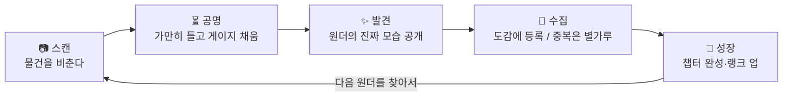

# 📜 HISTORY — Wonder Scanner 4시간 스프린트 기록

> 이 문서는 개발 중 README에 있던 **진행 현황 보드**를 옮겨 온 것입니다.
> 프로젝트 소개는 [README.md](README.md)를 보세요.

## 0. 한 줄 요약

Gemini 브레인스토밍의 아이디어 3번 **"AI 매직 렌즈: 일상의 놀라운 재발견"**(웹캠 + 온디바이스 사물 인식 + 유머러스 재해석 카드)을
**수집형 게임**으로 확장했다. 게임 요소(코어루프·밸런스·서사·연출)를 붙이고, 정적 웹으로 Vercel에 배포했다.

- 라이브: https://wonderscanner.vercel.app
- 저장소: https://github.com/akillness/wonder_scanner
- 결과: 80종 원더 / 4단계 희귀도 / 6챕터 / 10랭크 / 카드 공유 / 100% 브라우저 추론

## 1. 원안 → 게임으로 바꾼 것

| 원안 (Gemini 아이디어 3) | 게임화 결정 | 이유 |
|---|---|---|
| 사물 비추면 엉뚱한 수식어 카드 1장 | **80종 전부에 이름·설정·희귀도·챕터 부여** → 도감 | "한 번 웃고 끝"을 "다 모으고 싶다"로 바꾸는 핵심 |
| 즉시 결과 | **공명 게이지**(1.5~3초 유지) | 스캔에 "실력"과 긴장감 부여, 오탐도 걸러짐 |
| 없음 | **희귀도 = 실생활 조우 확률** | 책상 물건은 일반, 기린·비행기는 전설. 현실이 곧 드롭 테이블 |
| 없음 | **변이체(프리즘) 4~10%** | 같은 컵을 다시 찍어도 기대감 유지 |
| 없음 | **별가루 + 15초 쿨다운** | 중복이 헛수고가 아니되, 연타 파밍은 차단 |
| 없음 | **루페(Lupe) 캐릭터 + 챕터 스토리 + 엔딩** | 수집 목표를 "80개"가 아니라 "이 방의 10개"로 쪼개고 의미 부여 |
| 카드 생성 (html2canvas) | Canvas 2D 직접 렌더 → PNG 저장/공유 | 의존성 0, 카드 디자인 완전 제어 |
| TF.js Coco-SSD CDN | npm 번들 + 별도 청크(`tf-*.js`) | 캐시 효율, Vite 트리쉐이킹 |

## 2. 타임라인 (실제 커밋 시각 기준)

```mermaid
gantt
    title 실제 진행 (2026-09-23, 커밋 시각)
    dateFormat  HH:mm
    axisFormat  %H:%M
    section 기획·셋업
    P0 게임 디자인 + P1 Vite/TF.js 셋업      :done, p1, 15:40, 15:56
    section 구현
    P2 80 원더·밸런스·저장·서사 데이터        :done, p2, 15:56, 15:57
    P3~P5 스캐너·화면 4종·연출·카드           :done, p3, 15:57, 16:01
    section 검증·배포
    P6 브라우저 QA(Chrome DevTools) + 수정    :done, p6, 16:01, 16:07
    P7 Vercel 프로덕션 배포 + Git 푸시         :done, p7, 16:07, 16:12
    P8 README 소개 + HISTORY 작성             :done, p8, 16:12, 16:20
```

| 커밋 | 시각 | 내용 |
|---|---|---|
| `c29fd66` | 15:40 | Initial commit (빈 저장소) |
| `0abaf56` | 15:56 | P0/P1: 게임 디자인 보드 + Vite/TF.js 스캐폴드 |
| `9920e37` | 15:57 | P2: 80 원더, 희귀도/챕터, 밸런스 곡선, 저장 상태, 루페 대사 |
| `2955fb8` | 16:01 | P3–P5: 스캐너, 화면 4종, 공명 루프, FX/오디오, 공유 카드 |
| `02ec778` | 16:07 | P6: 브라우저 QA 수정 2건 + 스크린샷 |
| (이 커밋) | — | P7/P8: 배포 URL·QR, README 소개, HISTORY |

## 3. 단계별 체크리스트 (최종)

| 단계 | 내용 | 상태 |
|---|---|---|
| P0 | 게임 디자인 (코어루프 / 밸런스 / 서사) | ✅ |
| P1 | Vite + TF.js / COCO-SSD / canvas-confetti | ✅ |
| P2 | 80종 원더, 희귀도 4단계(24/26/20/10), 6챕터(10/21/15/13/11/10), XP 곡선 10단계 | ✅ |
| P3 | 카메라 스트림 + 온디바이스 탐지 + 공명 게이지 + 사진 업로드 폴백 | ✅ |
| P4 | 타이틀 → 스캔 → 발견 → 도감 (+ 상세 모달) | ✅ |
| P5 | 희귀도별 파티클, 플래시/글리치/셰이크/슬로모, Web Audio 합성음, 카드 PNG 저장·공유 | ✅ |
| P6 | Chrome DevTools로 390×844 모바일 뷰포트 QA, 빌드 통과 | ✅ |
| P7 | `vercel --prod` → https://wonderscanner.vercel.app, `git push origin main` | ✅ |
| P8 | README를 소개 문서로 교체, HISTORY.md 분리 | ✅ |

## 4. 설계 결정 (ADR-lite)

1. **Vanilla JS + 순수 CSS** (React/Tailwind 대신) — 화면 4개, 상태 1개. 프레임워크 셋업 시간이 오히려 손해. 애니메이션은 CSS keyframes로 충분.
2. **`lite_mobilenet_v2`** — COCO-SSD 3종 중 가장 가볍고 모바일에서 실시간. 정확도 손실은 "공명 게이지 유지"가 흡수.
3. **타깃 선택 = 신뢰도 0.7 + 화면 점유율 0.3** — 배경의 작은 물체 대신 "의도적으로 가까이 비춘 것"을 고르게.
4. **localStorage 단일 키** — Supabase 랭킹은 스코프 밖. 스키마는 `state.js` 상단 주석에 고정.
5. **Web Audio 합성음** — 오디오 에셋 0개, 로딩 0ms. 게이지 진행도에 따라 틱 피치·간격이 변해 "차오르는" 느낌.
6. **밸런스 상수 단일 파일** — `balance.js`만 고치면 전체 난이도 조정. 튜닝을 코드 리뷰 없이 가능하게.
7. **카드 공유** — 터치 기기(`pointer: coarse`)만 Web Share, 데스크톱은 즉시 다운로드 (QA에서 발견한 데스크톱 공유 시트 행 방지).

## 5. QA 로그 (Chrome DevTools MCP, 390×844)

| 시나리오 | 방법 | 결과 |
|---|---|---|
| 타이틀 렌더 / 루페 타이핑 | 스크린샷 | ✅ 콘솔 에러 0 |
| 모델 로드 | 스캔 진입 | ✅ WebGL 백엔드, 수 초 내 완료 |
| 카메라 거부 → 사진 폴백 | `getUserMedia` reject 주입 | ✅ 폴백 화면 + 파일 선택 |
| 신규 발견 (dog, 97%) | 사진 업로드 | ✅ NEW! 스탬프, 희귀, +40 XP +20 별가루, 루페 대사 |
| localStorage 저장 | 스크립트 조회 | ✅ 스키마 일치, 리로드 후 1/80 유지 |
| 도감 / 챕터 탭 / 상세 모달 | 클릭 | ✅ 잠긴 슬롯 실루엣, 소유 슬롯 발광 |
| 중복 발견 (dog ×2, ×3) | 재업로드 | ✅ ×n 스탬프, +8 XP +6 별가루, 중복 대사 |
| 쿨다운 | 모듈 직접 검증 | ✅ 직후 재스캔 `ok:false, remain 15000ms` |
| 랭크 업 (XP 56 ≥ 50) | 세 번째 스캔 | ✅ 「렌즈 수습생」 토스트 |
| 다른 클래스 (laptop, 95%) | 사진 업로드 | ✅ 신규 일반 원더 |
| 카드 PNG 저장 | 클릭 | ✅ "저장됨" (수정 후) |
| 프로덕션 빌드 | `vite build` | ✅ index 21KB gz / tf 274KB gz / css 3KB gz |

**발견·수정한 버그**
1. 카메라 권한 대기 중 상태 오버레이가 하단 컨트롤을 덮어 사진 폴백에 접근 불가 → `.scan .bottom` z-index 상향.
2. 데스크톱 Chrome에서 `navigator.share()`가 시스템 다이얼로그를 기다리며 무한 대기 → 터치 기기에서만 공유, 그 외 즉시 다운로드.

**미검증 항목(환경 제약)**: 실제 카메라 스트림에서의 공명 루프는 헤드리스 브라우저에 카메라가 없어 코드 리뷰와 사진 경로로만 검증. 실기기(iOS Safari / Android Chrome) 확인 권장.

## 6. 배포 기록

| 항목 | 값 |
|---|---|
| Vercel 프로젝트 | `wonder_scanner` (akillness-projects) |
| 프로덕션 | https://wonderscanner.vercel.app |
| 상태 | ● Ready, HTTP 200, `tf-*.js` 청크 200 |
| 빌드 | Vite 7.3.6, Node 26 |
| 진입 QR | `docs/qr.png` |

## 7. 스프린트 2 — AR · 콘텐츠 · 제품 폴리싱 (2026-09-23 오후)

요청: "UI와 콘텐츠가 부족하다. 단순히 찍는 게 아니라 AR 같은 요소. 딥서치 후 개선·테스트·배포. 캐릭터·아이콘 리소스, 프로덕트 수준 폴리싱."

### 리서치 → 설계 결정
| 근거 | 적용 |
|---|---|
| Pokémon GO 서클 타이밍: 링 크기가 스킬 테스트, 색이 정보, 연속 배율이 보상 ([GO Hub](https://pokemongohub.net/post/wiki/catch-mechanics/), [ring guide](https://www.switchbladegaming.com/pokemon-go/catch-ring-guide/)) | **포획 타이밍 링** + PERFECT/GREAT/GOOD/MISS 등급, 미스 시 도망 |
| Zeigarnik / Endowed Progress: 절반 넘긴 세트, 빈 실루엣이 완성 욕구를 만든다 ([Yu-kai Chou](https://yukaichou.com/advanced-gamification/game-design-technique-collection-sets/)) | 도감 챕터 링 진행도, "N개만 더!" 넛지, HUD 나침반 힌트 |
| 변동 비율 보상 + 희귀 변이체의 예측 오차 도파민 ([Psychology of Games](https://www.psychologyofgames.com/2019/12/why-do-people-collect-virtual-items/)) | 정령 8% 황금 → 프리즘 토큰, 퍼펙트 시 변이체 ×3 |
| 세트 완성만 보상하지 말 것, 계층형 보상 ([Game Wisdom](https://game-wisdom.com/critical/collectible-design-videogames), [GameRefinery](https://www.gamerefinery.com/attracting-and-retaining-players-with-collection-systems/)) | 정령 조각 → 부스트, 의뢰 3단, 업적 15, 도감 깊이 노트 |
| New Pokémon Snap: 명확한 채점 축이 만족감 ([Game8](https://game8.co/games/New-Pokemon-Snap/archives/328684)) | 등급·배율을 리빌 화면에 숫자로 표기 |
| 브라우저 AR = getUserMedia + deviceorientation + 캔버스, 3-DoF "둘러보기"가 현실적 ([Gyro-web](https://trekhleb.dev/blog/2021/gyro-web/), Aside 리서치) | 자이로 앵커 정령, 스크린 스페이스 오라·태그·링 |
| Pokémon GO AR은 배터리·난이도로 끄는 유저가 많음 | AR 요소는 전부 캔버스 2D, 설정에서 모션 줄이기·자동 포획 제공 |

### 추가된 것
- **AR 레이어**: 스무딩 브래킷, 오라 파티클, 홀로 태그, 자이로 앵커 정령(탭 포획, 황금 정령), 포획 링, 등급 버스트
- **콘텐츠**: 오늘의 의뢰 3개(날짜 시드), 연속 출석 배율, 업적 15종, 도감 깊이 노트(3회/10회), 프리즘 토큰, 공명 부스트, 나침반 힌트
- **화면**: 튜토리얼, 의뢰, 프로필(통계·업적·설정), 하단 탭, 토스트 스택
- **리소스**: Pollinations 생성물은 흐리고 워터마크가 있어 폐기 → 손으로 그린 SVG(루페 마스코트, 로고, 챕터 엠블럼 6종, 총 6KB)
- **접근성**: 모션 줄이기 / 자동 포획 / 햅틱 / 사운드 토글, 저장 스키마 v2 마이그레이션

### QA (Chrome DevTools, 390×844, 카메라 거부 폴백 + 사진 주입)
| 시나리오 | 결과 |
|---|---|
| 3사이클 무입력 → AUTO 포획 (dog) | ✅ NEW, +40/+20, 의뢰 "희귀 이상" 완료 → 프리즘 토큰, 업적 2개 |
| 링 r=0.328 탭 (laptop) | ✅ PERFECT, XP 45 (20×1.5×1.5), 별가루 60 (10×3×2), 변이체, 랭크 업 |
| 링 r=0.90 탭 (cup) | ✅ MISS → 도망, 게이지 0.48, misses+1, 재충전 |
| 재충전 후 r=0.46 탭 | ✅ GOOD, 장착한 프리즘 토큰 소비 → 변이체 확정 |
| 정령 탭 | ✅ 조각 0→1, 별가루 +2, 플로팅 텍스트 |
| 도감/의뢰/프로필 | ✅ 렌더·탭 이동, 콘솔 에러 0 |

**발견·수정한 버그**: (1) 카메라 폴백 오버레이가 HUD·토큰 칩 위에 있어 탭 불가 → z-index. (2) 타이틀 보조 버튼 3개가 세로로 줄바꿈 → nowrap.
**게임 필 계약**: `docs/game-feel-contract.json` (validate-game-feel.py 통과). 실기기 터치 지연에서 PERFECT 창(±135ms) 검증은 남음.

## 8. 스프린트 3~5 — 소셜 · 추억 · 경제 · 스크래치 · 클라우드 · 대결 · NPC (2026-09-23 오후~저녁)

요청(순서대로): 추억 앨범·공유·거래·영상 / 소리·영상 저장 + 압축 / 스크래치 발견 + Google 로그인 + 광장 + 세계관 확장 / 추억 진화·회상·다듬기 + PRD + SVG 문서 / 추억 대결 연출 / 지능형 NPC 비서·사건.

| 기능 | 구현 | 검증 |
|---|---|---|
| 추억 앨범 | IndexedDB, 사진 640px·JPEG .74(46KB 실측), 썸네일, 160MB LRU | ✅ 2장 저장·필터·상세 |
| 포획 클립 | 합성 캔버스(비디오+오버레이) → MediaRecorder 540p·1.1Mbps + Web Audio 믹스(MediaStreamDestination) | ⏳ 실기기 (헤드리스 정지 이미지 녹화 시 브라우저 크래시 → 라이브 카메라에서만 녹화로 제한) |
| 압축 정책 | compresso는 데스크톱 FFmpeg 앱이라 런타임 사용 불가 → 동일 원칙을 브라우저에서 적용 | ✅ |
| 경제 | 상점 6종, 보물상자 6, 목표 사다리, 콤보 | ✅ |
| 선물 코드 | base64url + 체크섬, 중복 수령 방지 | ✅ 생성 |
| 스크래치 | 캔버스 destination-out, 50% 자동 공개, 모션 줄이기=탭 | ✅ 긁어서 제거 확인 |
| 추억 진화 | 6종 포인트 → 4단계, 회상 1일 1회, 다듬기(캡션·필터 5·프레임) | ✅ 씨앗→새싹→만개 |
| 추억 대결 | 3스탯 3라운드 결정적 시뮬 + HP·피격·승자 연출, 그림자 상대 | ✅ WIN +40 |
| 동행 NPC | 12개 우선순위 규칙 조언, 5종 하루 사건(배율·부탁·도전장) | ✅ 사건 카드·아바타 |
| 클라우드 | provider 어댑터 + Firebase(Auth·Storage·Firestore) 동적 import, 광장 화면, 규칙·설정 문서 | ✅ 코드·문서 / ⏳ 키 (사용자 계정 필요) |
| 세계관 확장 | worlds/index.js 레지스트리 | ✅ |
| 리소스 | Pollinations 생성물 폐기 → 손그림 SVG(루페·로고·챕터 6) + 문서용 SVG 다이어그램 4종 | ✅ |

**버그 수정**: 타이틀 TDZ(사건 변수) · 타이틀 콘텐츠 넘침(스크롤로) · 스크래치 synthetic pointer capture · getImageData willReadFrequently.
**번들**: 앱 128KB(50KB gz) · CSS 28KB · TF 1.07MB(274KB gz, 캐시) · Firebase는 키 없으면 트리쉐이킹으로 0.

## 9. 스프린트 6 — 렌즈 스킬 · 제스처 조작 (2026-09-23 저녁)

요청: "이미지 포토샵·왜곡·톤보정·쉐입·숨은사진·이모티콘 같은 스킬 요소, 손가락 제스처·얼굴 움직임으로 아이템 획득·스킬·캡처·영상 촬영."

| 기능 | 구현 | 검증 |
|---|---|---|
| 스킬 6종 | `skills.js`: 왜곡(역매핑 픽셀 리샘플 3모드), 톤(CSS filter 합성), 쉐입 5, 이모지 20, 숨은 이모지/가리기, 광채. 랭크 해금 또는 상점 구매 | ✅ 구매 4종, 6종 모두 적용·굽기(41→61KB), 원본 보존 |
| 스킬 에디터 | 캔버스 프리뷰 480px, 탭/드래그 배치, 슬라이더, 프리셋 | ✅ 스크립트 조작 |
| 성장 연동 | 스킬 1종 +1pt, 3종 +1pt → ⭐ 별 도달 | ✅ |
| 숨은 그림 찾기 | 회상/상세에서 10초 안에 탭 → ✨15 | ✅ 정답 좌표 탭 |
| 가리기 | 앨범 썸네일 블러 + 상세에서 스크래치 | ✅ 렌더 |
| 제스처 | MediaPipe GestureRecognizer(손 1) + FaceLandmarker(블렌드셰이프) 동적 import, 100ms 추론, 350ms 홀드 발동, 손끝 포인터 | ✅ 두 모델 로드(헤드리스 XNNPACK) / ⏳ 실기기 인식 |
| 매핑 | ✌️탭 ✊정령 🖐촬영(20초 자유 클립) 👍토큰 🤟스냅 ☝️포인터 · 😉탭 😮흡입 🤨토큰 😄스냅 | 코드 검증 |
| 번들 | 앱 152KB(58KB gz) · MediaPipe 청크 154KB(46KB gz, 제스처 ON 시) · 모델·WASM은 CDN | ✅ |

## 10. 스프린트 7 — 디자인 시스템 · 실루엣 · 아우라 · 카메라 퍼스트 · 위치 (2026-09-23 저녁, 세션 2개 병렬)

요청: "/taste-design 게임·세계관에 맞게 UI·아트 리소스 업데이트", "추적 중인 실루엣을 남겨 진행 상황 파악", "오브젝트별 아우라 스킨", "단순 카메라 + 게임 레이어, 앨범 꺼내기·수정·공유 인터랙티브", "구글 위치 기반 주변 촬영지·기믹 추천".

| 산출물 | 내용 | 검증 |
|---|---|---|
| `DESIGN.md` | 「황동 렌즈 탐험 일지」: 잉크 4단계 + Bone 활자 + 황동 단일 악센트, 희귀도 잉크(무쇠·녹청·자수정·황동), Fraunces·Gowun Batang·IBM Plex, 이모지는 원더 글리프만, 모바일 게임 원칙(390×844, 엄지 영역, 폰 셸, PWA) | 디자인·접근성·회귀 리뷰 3종 + v4 스크린샷 |
| 아트 | `icons.js` 70+ 라인 아이콘, 로고(황동 조리개), 루페(모노클+체인+녹청 꼬리), 챕터 엠블럼 6종 | 금지 색상 0건 |
| `docs/GAMEPLAY_V7.md` | §1 추적 실루엣(각인 윤곽·잔상·잔영·진행 태그·기록) §2 액션 연출 §4 명암·아우라 5종·임팩트 §6 카메라 퍼스트 §7 위치 추천 | game-vfx 검증기 통과 계약 2종 |
| 구현 (병렬 세션이 5d66e8c 로 커밋) | `staging.js`·`overlay.js`, `auras.js` + 상점/도감 장착, `camera/frames.js` 베스트 포토, `media.js` 추가 스키마, `geo/*` + `spots.js`, `v7.css`, PWA manifest | 빌드 통과 |

세션 2개가 같은 트리에서 작업하는 동안 파일 소유권을 나눴다(이 세션: 문서·연출·아우라·앨범·위치 / 상대: `scan.js`·`scanner/*`·`state`·`balance`·`meta`·`styles`·`icons`).

## 11. 스프린트 8 — 아이 게이지(시선 추적) · 정밀도 · 위치 실동작 (2026-09-23 밤)

요청: "제스처를 빼고 아이 게이지(시선 추적)로 대체", "인식률·정밀도 높여서 QA", "주변 위치 서비스 실제 동작", "빌드·배포·푸시".

| 항목 | 구현 | 검증 |
|---|---|---|
| 시선 게이지 (상대 세션 v8) | FaceLandmarker 블렌드셰이프+머리 자세 → 시선점, 0.9s/0.6s 홀드, 흔들림 등급, 보정, 눈 배지 | 헤드리스 주입 |
| 정밀도 v8.2 | 깜빡임 유예 300ms · 이탈 유예 150ms · 유지 판정 35% · One Euro 필터 · 20Hz 추론 · 약한 감지로 잠금 유지 | `npm test` 14/14 (단속운동 1450→1017ms, 떨림 1.03→0.94px, 점프 응답 267→33ms) |
| 위치 실동작 | Overpass 공개 미러 전부 406/429/타임아웃 → **Nominatim 경계 상자 검색**(1초 간격)을 1차 폴백으로 | 서울시청 20곳 / 2.7초, 추천 5곳 + 기믹 |
| 설정 | 셔터음 · 베스트 포토 · 오버레이 합성 녹화 · 위치 기반 추천 행 | 프로필 |

## 12. 남은 아이디어

- 일일 퀘스트("오늘은 부엌에서 3개") / 스트릭
- Supabase 1테이블 글로벌 도감 완성률 랭킹
- 원더별 커스텀 일러스트 (현재 이모지)
- 다국어(EN) 원더 이름·설정
- 챕터 6 완성 후 "히든 챕터" — 라벨 조합(사람+개=산책)으로 해금되는 합성 원더

## 부록. P0 게임 디자인 원문

### 코어 루프

### 밸런스 축

| 축 | 설계 | 이유 |
|---|---|---|
| 희귀도 | ⭐일반 / ⭐⭐희귀 / ⭐⭐⭐영웅 / ⭐⭐⭐⭐전설 | 실생활에서 마주칠 확률로 배분 |
| 변이체 | 스캔마다 소확률로 프리즘 변이체 | 같은 컵을 다시 찍어도 기대감 유지 |
| 공명도 | AI 신뢰도 → 게이지 속도·변이체 확률 보너스 | "잘 비추는 실력"이 보상으로 |
| 별가루 | 중복 시 지급, 랭크 XP로 환산 | 중복이 헛수고가 되지 않게 |
| 챕터 세트 | 6개 테마, 완성 시 스토리 해금 | 수집 목표를 작게 쪼개기 |

### 서사

당신은 원더 탐험가. 안내 AI 루페(Lupe)가 렌즈에 깃들어 있다.
"세상은 원더로 가득한데, 사람들은 그냥 '컵'이라고 부른다."
챕터를 완성할 때마다 루페가 원더 세계의 비밀을 한 조각씩 들려준다.
