# 🔭 WONDER SCANNER — 진행 현황 보드

> 이 README는 **개발 중 진행 상황 보드**입니다. 완료 후에는 프로젝트 소개로 교체되고,
> 이 보드는 `HISTORY.md`로 옮겨집니다.

## 한 줄 요약 (ELI5)

**"카메라로 컵을 비추면, 컵이 사실은 '은하계 연료 탱크'였다는 걸 알려주는 도감 게임."**
평범한 물건에 숨어 있는 **원더(Wonder)** 를 찍어서 모으고, 도감을 채워 탐험가 랭크를 올립니다.

## 진행 타임라인 (4시간 컷)

```mermaid
gantt
    title Wonder Scanner 4h 스프린트
    dateFormat  HH:mm
    axisFormat  %H:%M
    section 기획
    P0 게임 디자인(코어루프·밸런스·서사)   :done, p0, 00:00, 25m
    section 구현
    P1 프로젝트 셋업(Vite+TF.js)          :done, p1, after p0, 10m
    P2 데이터·밸런스(80 원더, 희귀도, 챕터) :active, p2, after p1, 40m
    P3 스캐너(카메라+COCO-SSD+공명 게이지)  :p3, after p2, 35m
    P4 코어루프 UI(타이틀·스캔·발견·도감)   :p4, after p3, 45m
    P5 연출(파티클·글리치·사운드·카드 공유)  :p5, after p4, 35m
    section 마무리
    P6 QA·빌드                             :p6, after p5, 15m
    P7 Vercel 배포 + Git 푸시               :p7, after p6, 15m
    P8 문서(README 소개 + HISTORY.md)       :p8, after p7, 20m
```



## 단계별 체크리스트

| 단계 | 내용 | 상태 |
|---|---|---|
| P0 | 게임 디자인 문서 (코어루프 / 밸런스 / 서사) | ✅ 완료 |
| P1 | Vite 프로젝트 + TF.js / COCO-SSD / canvas-confetti 설치 | ✅ 완료 |
| P2 | 80종 원더 데이터, 희귀도 4단계, 6개 챕터, XP 곡선 | 🔄 진행 중 |
| P3 | 카메라 스트림 + 온디바이스 탐지 + 공명(Resonance) 게이지 | ⬜ 대기 |
| P4 | 화면 4종: 타이틀 → 스캔 → 발견(Reveal) → 도감(Codex) | ⬜ 대기 |
| P5 | 희귀도별 파티클, 화면 흔들림/글리치, Web Audio 효과음, 카드 PNG 공유 | ⬜ 대기 |
| P6 | 모바일 뷰포트 확인, 빌드 통과 | ⬜ 대기 |
| P7 | `vercel --prod` 배포, `git push origin main` | ⬜ 대기 |
| P8 | README를 소개 문서로 교체, `HISTORY.md` 작성 | ⬜ 대기 |

## 게임 디자인 요약 (P0 산출물)

### 코어 루프


### 밸런스 축

| 축 | 설계 | 이유 |
|---|---|---|
| 희귀도 | ⭐일반 / ⭐⭐희귀 / ⭐⭐⭐영웅 / ⭐⭐⭐⭐전설 | 실생활에서 마주칠 확률로 배분. 책상 위 물건은 일반, 기린·비행기는 전설 |
| 변이체(Shiny) | 스캔마다 소확률로 **프리즘 변이체** 등장 | 같은 컵을 다시 찍어도 "혹시?" 하는 기대감 유지 |
| 공명도 | AI 인식 신뢰도 → 게이지 속도 · 변이체 확률 보너스 | "잘 비추는 실력"이 보상으로 이어지는 스킬 요소 |
| 별가루 | 중복 스캔 시 지급, 랭크 XP로 환산 | 중복이 헛수고가 되지 않게 |
| 챕터 세트 | 6개 테마 세트, 완성 시 스토리 조각 해금 | 수집 목표를 "80개"가 아니라 "이 방 안의 8개"로 쪼개 줌 |

### 서사

당신은 **원더 탐험가**. 안내 AI **루페(Lupe)** 가 렌즈에 깃들어 있다.
"세상은 원더로 가득한데, 사람들은 그냥 '컵'이라고 부른다."
챕터를 완성할 때마다 루페가 원더 세계의 비밀을 한 조각씩 들려준다.

## 로컬 실행

```bash
npm install
npm run dev     # http://localhost:5173 (카메라는 HTTPS 또는 localhost 필요)
```
