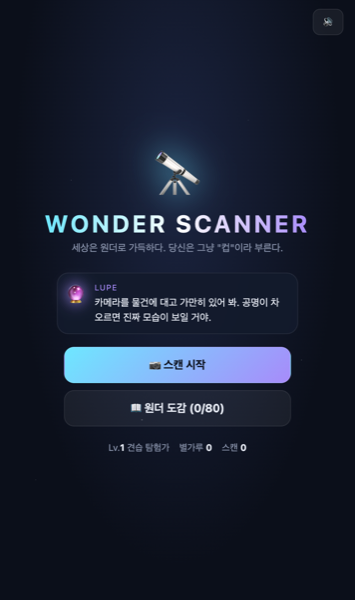
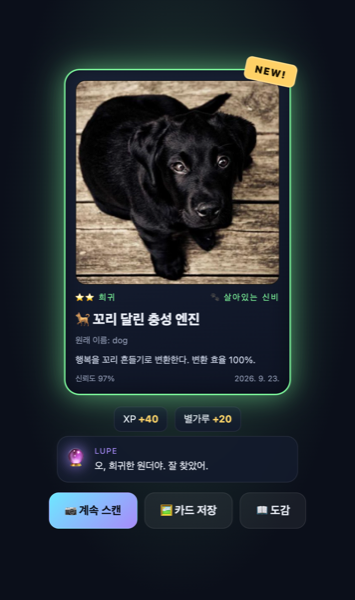
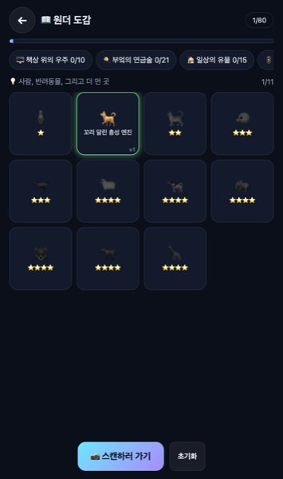
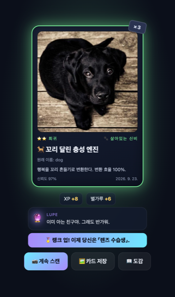
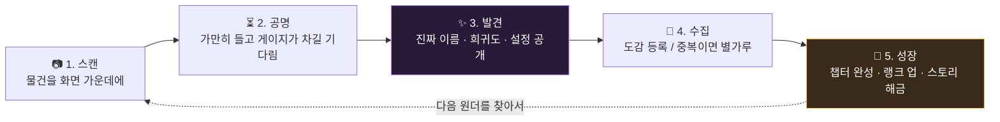
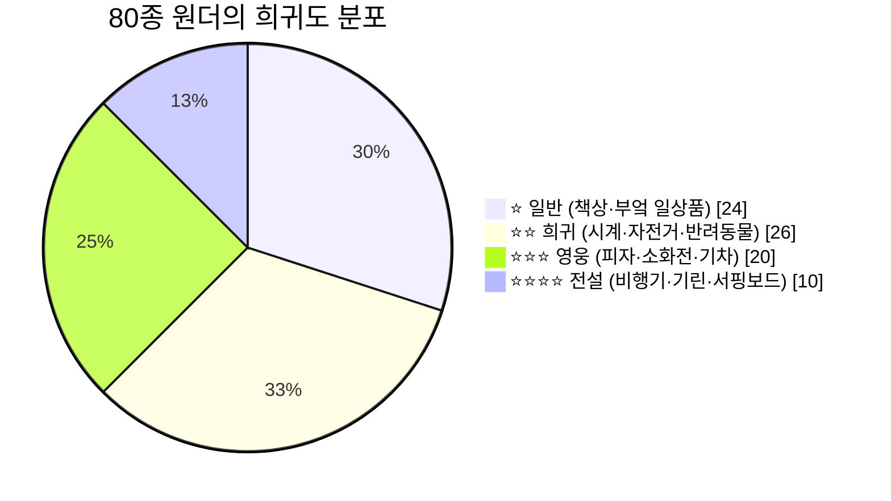
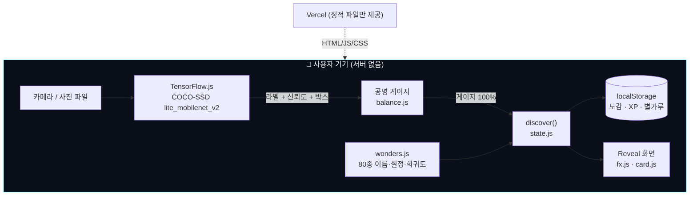

<div align="center">

# 🔭 WONDER SCANNER

**세상은 원더로 가득하다. 당신은 그냥 "컵"이라 부른다.**

카메라로 주변 물건을 비추면, 그 물건의 *진짜 모습*(원더)이 드러나는 **수집형 도감 게임**입니다.
AI는 100% 브라우저 안에서만 돌아갑니다. 사진은 어디로도 전송되지 않습니다.

[](https://wonderscanner.vercel.app)


<sub>스마트폰 카메라로 QR을 찍으면 바로 시작됩니다 (카메라 권한 필요)</sub>

<br/>

| 타이틀 | 발견(Reveal) | 도감(Codex) | 랭크 업 |
|:--:|:--:|:--:|:--:|
|  |  |  |  |

</div>

---

## 🧒 이게 뭐예요? (ELI5)

> **다섯 살에게 설명하면:**
> 마법 망원경이 있어요. 컵을 들여다보면 "이건 사실 우주선 연료 탱크야!"라고 알려줘요.
> 그렇게 찾은 것들을 스티커북에 붙여요. 스티커북을 다 채우면 마법사가 비밀 이야기를 들려줘요.

| ELI5 용어 | 게임 안에서의 뜻 | 실제로는 |
|---|---|---|
| **원더 (Wonder)** | 평범한 물건의 "진짜 모습" | AI가 인식한 사물 80종 각각에 붙인 재해석 이름 + 한 줄 설정 |
| **렌즈** | 원더를 보여주는 마법 망원경 | 스마트폰 카메라 + 브라우저 안의 사물 인식 AI |
| **공명 (Resonance)** | 렌즈를 가만히 대고 있으면 차오르는 빛 | AI가 같은 물체를 연속으로 인식하는 동안 채워지는 게이지 |
| **도감 (Codex)** | 스티커북 | 발견한 원더 80칸짜리 컬렉션 (기기에 저장) |
| **별가루** | 이미 있는 스티커를 또 뽑았을 때 받는 사탕 | 중복 발견 시 지급되는 자원, 랭크 XP로 이어짐 |
| **변이체 (프리즘)** | 반짝이는 희귀 스티커 | 약 4~10% 확률의 특별 색상 버전 (보상 3배) |
| **챕터** | 스티커북의 페이지 | 장소별 6개 테마 세트 (책상·부엌·집·거리·생물·놀이) |
| **루페 (Lupe)** | 렌즈 속에 사는 마법사 친구 | 상황별 대사와 스토리를 들려주는 안내 캐릭터 |
| **랭크** | 탐험가 배지 | XP 누적에 따라 열리는 10단계 칭호 |

---

## 🎮 어떻게 노나요?



1. **스캔 시작**을 누르고 카메라 권한을 허용합니다.
2. 컵, 노트북, 의자… 아무 물건이든 화면 가운데에 두세요. 물체에 **브래킷**이 생기고 **공명 링**이 차오릅니다.
3. 링이 꽉 차면 화면이 번쩍이며 **원더 카드**가 뒤집혀 나타납니다.
4. 카드는 **PNG로 저장/공유**할 수 있습니다.
5. 카메라가 없는 PC에서는 **사진 파일**을 골라 같은 방식으로 스캔할 수 있습니다.

---

## ⚖️ 밸런스 설계

### 희귀도 — "얼마나 자주 마주치는가"로 배분



### 보상표

| 희귀도 | 첫 발견 XP | 첫 발견 별가루 | 중복 XP | 중복 별가루 |
|:--:|:--:|:--:|:--:|:--:|
| ⭐ 일반 | 20 | 10 | 4 | 3 |
| ⭐⭐ 희귀 | 40 | 20 | 8 | 6 |
| ⭐⭐⭐ 영웅 | 80 | 40 | 14 | 12 |
| ⭐⭐⭐⭐ 전설 | 160 | 80 | 25 | 24 |

- **변이체**: 별가루 ×3, XP ×1.5. 확률 = 4% + (신뢰도 − 0.5) × 12% → 잘 비출수록 최대 10%.
- **공명 속도**: AI 신뢰도가 높을수록 빨리 찹니다. 기준 약 2.2초. 놓치면 빠르게 감소합니다.
- **쿨다운 15초**: 같은 물건 연타 파밍을 막습니다. 다른 물건을 찾게 유도합니다.
- **챕터 완성 보너스**: +120 XP와 루페의 스토리 조각.
- **랭크 10단계**: 견습 탐험가(0) → 렌즈 수습생(50) → 골목 관찰자(150) → … → 원더 마스터(4600).

모든 숫자는 [`src/game/balance.js`](src/game/balance.js) 한 파일에 있습니다.

---

## 📜 서사 — 루페와 여섯 개의 챕터

당신은 **원더 탐험가**. 렌즈 속에 사는 안내 AI **루페(Lupe)** 가 발견마다 반응하고,
챕터를 완성할 때마다 원더 세계의 비밀을 한 조각 들려줍니다. 80종을 모두 모으면 엔딩 대사가 열립니다.

| 챕터 | 장소 힌트 | 원더 수 | 대표 원더 |
|---|---|:--:|---|
| 🖥️ 책상 위의 우주 | 책상 주변 | 10 | 컵 → *은하계 연료 탱크* |
| 🍳 부엌의 연금술 | 냉장고·식탁 | 21 | 냉장고 → *시간 정지 금고* |
| 🏠 일상의 유물 | 거실·침실·현관 | 15 | 소파 → *집 안의 늪* |
| 🚦 거리의 거인들 | 밖으로 | 13 | 소화전 → *도로변 물의 봉인탑* |
| 🐾 살아있는 신비 | 사람·동물 | 11 | 고양이 → *액체 상태의 군주* |
| 🎈 놀이의 파편 | 공원·바다·산 | 10 | 연 → *실에 묶인 작은 하늘 배* |

---

## 🎆 연출

| 순간 | 연출 |
|---|---|
| 공명 중 | 희귀도 색 브래킷, 빛나는 링, 게이지에 따라 빨라지는 틱 사운드, 스캔 라인 |
| 발견 (모든 등급) | 화면 플래시 → 카드 3D 플립 → 스탬프(NEW! / ×n) → 파티클 |
| 영웅 이상 | 글리치 + 화면 흔들림 + 슬로모션 진입 |
| 전설 · 변이체 | 회전 후광(rays) + 별 모양 파티클 비 + 저음 드론 사운드 + 햅틱 |
| 랭크 업 / 챕터 완성 | 토스트 + 추가 파티클 + 스토리 카드 |

사운드는 에셋 없이 **Web Audio 합성**으로 만들어 로딩 비용이 0입니다. 타이틀 우상단에서 끌 수 있습니다.

---

## 🧠 구조 — 전부 브라우저 안에서



- **개인정보**: 카메라 프레임은 기기 밖으로 나가지 않습니다. 저장되는 것은 도감 진행 상황(로컬)뿐입니다.
- **오프라인**: 모델(약 5MB)이 한 번 로드되면 인식은 네트워크 없이 동작합니다.

```
src/
├─ data/      wonders.js(80종) · chapters.js(6챕터)
├─ game/      balance.js(수치) · state.js(저장/보상) · narrative.js(루페 대사)
├─ scanner/   detector.js(TF.js) · camera.js(getUserMedia·스냅샷)
├─ ui/        fx.js(파티클·사운드·글리치) · card.js(공유 카드 PNG)
├─ main.js    화면 4종 + 스캔 루프
└─ styles.css
```

---

## 🚀 실행과 배포

```bash
npm install
npm run dev        # http://localhost:5173  (카메라는 localhost 또는 HTTPS에서만)
npm run build      # dist/
vercel --prod      # 정적 배포
```

| 항목 | 값 |
|---|---|
| 라이브 | https://wonderscanner.vercel.app |
| 스택 | Vite 7 · Vanilla JS · TensorFlow.js 4 · COCO-SSD · canvas-confetti · Web Audio |
| 데이터 | localStorage 단일 키 `wonder-scanner:v1` |
| 지원 | iOS Safari / Android Chrome (카메라), 데스크톱 브라우저 (사진 업로드) |

---

## ❓ 자주 묻는 것

- **인식이 안 돼요.** 물체를 화면의 절반 정도 크기로, 밝은 곳에서 비춰 보세요. 신뢰도 50% 이상만 인식합니다.
- **왜 사람도 원더인가요?** COCO 80종에 `person`이 포함되어 있고, "두 발로 걷는 질문 생성기"는 서사상 원더를 발견하는 유일한 종입니다.
- **데이터를 지우고 싶어요.** 도감 화면 하단 **초기화**.

---

## 📚 문서

- [`HISTORY.md`](HISTORY.md) — 4시간 스프린트 진행 기록 (기획 → 구현 → QA → 배포 → 남은 아이디어)
- 원안: Gemini 브레인스토밍 "AI 매직 렌즈: 일상의 놀라운 재발견" (아이디어 3번)을 게임 요소·밸런스·서사·코어루프·연출 중심으로 확장

<div align="center"><sub>Made in one 4-hour sprint · 2026-09-23</sub></div>
