<div align="center">

# 🔭 WONDER SCANNER

**English** · [한국어](README.ko.md)

**The world is full of Wonders. You just call it a "cup".**

Point your camera at everyday objects and their *true form* (a Wonder) is revealed. A collection-codex game.
The AI runs 100% inside your browser. Your photos are never sent anywhere.

[](https://wonderscanner.vercel.app)


<sub>Scan the QR code with your phone camera to start right away (camera permission required)</sub>

<br/>

<a href="docs/media/play.mp4">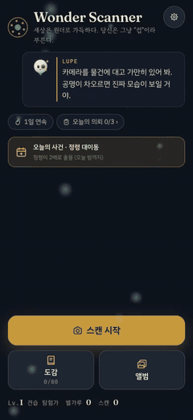</a>

<sub>▶ Click for a 40-second gameplay video (MP4, 390×844, 1.2MB) — start → how to use → photo scan → tap the capture ring → scratch → gaze (Eye Gauge) capture → Codex · Album · Quests · Profile</sub>

| Title | Lens tutorial | Capture ring | Scratch reveal |
|:--:|:--:|:--:|:--:|
| 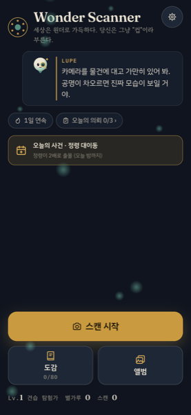 | 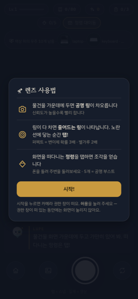 | 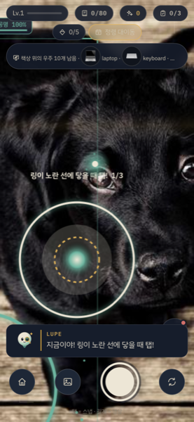 | 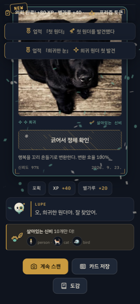 |
| **Codex** | **Album** | **Today's quests** | **Profile · Eye Gauge** |
| 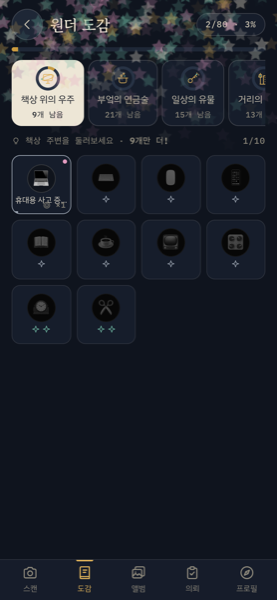 | 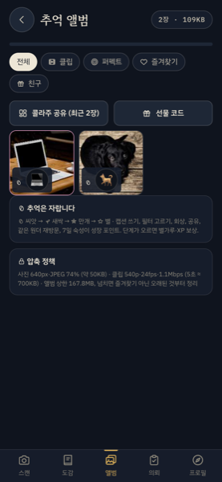 | 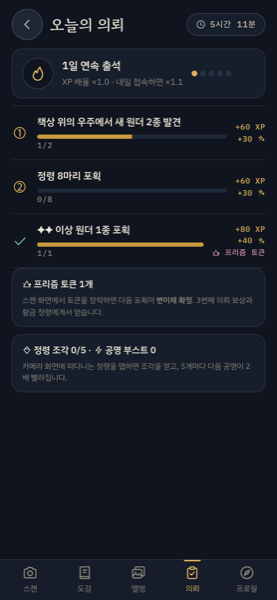 | 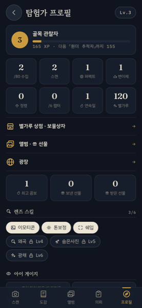 |

</div>

---

## 🧒 What is this? (ELI5)

> **Explained to a five-year-old:**
> There's a magic telescope. Look at a cup through it and it tells you, "This is actually a spaceship fuel tank!"
> You stick everything you find into a sticker book. Fill the book and the wizard tells you a secret story.

| ELI5 term | In the game | What it really is |
|---|---|---|
| **Wonder** | The "true form" of an ordinary object | A reinterpreted name + one-line lore for each of the 80 object classes the AI recognizes |
| **Lens** | The magic telescope that shows Wonders | Your phone camera + an object-recognition AI running in the browser |
| **Resonance** | Light that fills up while you hold the lens steady | A gauge that fills while the AI keeps recognizing the same object |
| **Codex** | The sticker book | An 80-slot collection of discovered Wonders (saved on your device) |
| **Stardust** | Candy you get for a sticker you already have | A resource paid out on duplicate discoveries, feeding rank XP |
| **Variant (Prism)** | A rare shiny sticker | A special-color version at roughly 4–10% (3× rewards) |
| **Chapter** | A page of the sticker book | Six themed sets by place (desk · kitchen · home · street · living things · play) |
| **Lupe** | A wizard friend living in the lens | The guide character who comments on what's happening and tells the story |
| **Rank** | Explorer badge | Ten titles unlocked as XP accumulates |

---

## 🎮 How do you play?

<p align="center">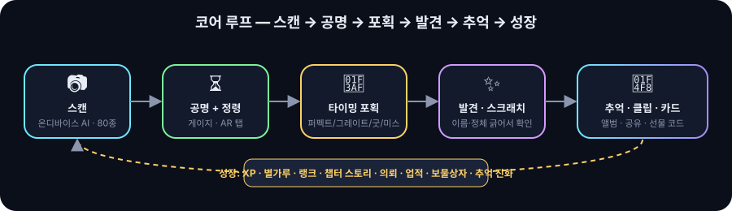</p>

1. Tap **Open camera** and allow camera access.
2. Put anything — a cup, a laptop, a chair… — in the middle of the screen. **Brackets and an aura** appear on the object and the **resonance ring** fills up.
3. When the ring is full, a **shrinking capture ring** appears. **Tap!** the moment it touches the yellow line.
   - 🎯 **Perfect** = XP ×1.5 · Stardust ×2 · Variant chance ×3 / ⭐ Great / ○ Good / ✖ Miss = the Wonder escapes; refill resonance
4. Tap the **Spirits** floating around the screen to collect Fragments (◇). 5 = your next resonance fills 2× faster. The occasional **Golden spirit** gives a Prism token.
5. Cards can be **saved/shared as PNG**. On a PC without a camera you can play the same loop with a **photo file**.

### 🧭 AR elements (no WebXR — 2D canvas + gyro)

| Element | Behavior |
|---|---|
| **Smoothed brackets + holo tag** | Interpolates the AI box to remove jitter and floats a label that sways above the object |
| **Aura particles** | More particles orbit the object as resonance rises (rarity color) |
| **Spirits** | Anchored to gyro yaw/pitch — turn the phone and they appear from off-screen; tap to pop them. They drift toward the recognized object |
| **Capture ring** | Like Pokémon GO's circle timing: tap as the shrinking ring meets the yellow line |
| **Compass hint** | The HUD shows the chapter closest to completion and missing Wonders — "Just 2 more!" |

---

## ⚖️ Balance design

### Rarity — distributed by "how often you run into it"

| Rarity | Count | Examples | Where |
|:--:|:--:|---|---|
| ⭐ Common | 24 | cup · laptop · chair · bottle | desk · kitchen · home |
| ⭐⭐ Rare | 26 | clock · bicycle · cat · banana | street · pets · fruit |
| ⭐⭐⭐ Epic | 20 | pizza · fire hydrant · train · kite | outings · play |
| ⭐⭐⭐⭐ Legendary | 10 | airplane · giraffe · surfboard · skis | travel · zoo · sea |

### Reward table

| Rarity | First-find XP | First-find Stardust | Duplicate XP | Duplicate Stardust |
|:--:|:--:|:--:|:--:|:--:|
| ⭐ Common | 20 | 10 | 4 | 3 |
| ⭐⭐ Rare | 40 | 20 | 8 | 6 |
| ⭐⭐⭐ Epic | 80 | 40 | 14 | 12 |
| ⭐⭐⭐⭐ Legendary | 160 | 80 | 25 | 24 |

- **Variants**: Stardust ×3, XP ×1.5. Chance = 4% + (confidence − 0.5) × 12% → up to 10% the better you frame it.
- **Resonance speed**: fills faster at higher AI confidence. About 2.2 s baseline. Drops quickly when you lose the object.
- **15 s cooldown**: stops farming the same object over and over, nudging you to find different things.
- **Chapter completion bonus**: +120 XP and a story fragment from Lupe.
- **10 ranks**: Apprentice Explorer (0) → Lens Trainee (50) → Alley Observer (150) → … → Wonder Master (4600).
- **Capture grades**: judged by the distance between the ring radius and the target (0.30). Perfect ≤0.045, Great ≤0.10, Good ≤0.17, otherwise Miss (gauge back to 35%). Three cycles with no input = auto-capture.
- **3 daily quests** (date-seeded): a mix of 2 new in a chapter / scan 5 times / 1 rare or better / 8 spirits / 2 Perfects. The 3rd quest = a **Prism token** (next capture is a guaranteed Variant).
- **Streak**: +10% XP per day, up to +50%.
- **Codex depth**: same Wonder 3 times → Lupe's observation note; 10 times → master note + gold frame.
- **15 achievements**: first Wonder · Legendary sighting · 10 Perfects · Golden spirit · 3-day streak, and more.

Every number lives in one file: [`src/game/balance.js`](src/game/balance.js).

---

## 📜 Story — Lupe and the six chapters

You are a **Wonder Explorer**. **Lupe**, the guide AI living in the lens, reacts to every discovery,
and each time you complete a chapter she tells you one more piece of the Wonder world's secret. Collect all 80 to unlock the ending.

| Chapter | Where to look | Wonders | Signature Wonder |
|---|---|:--:|---|
| 🖥️ The Desk Cosmos | around the desk | 10 | cup → *Galactic Fuel Tank* |
| 🍳 Kitchen Alchemy | fridge · dining table | 21 | refrigerator → *Time-Stop Vault* |
| 🏠 Everyday Relics | living room · bedroom · entrance | 15 | couch → *The Living-Room Swamp* |
| 🚦 Street Giants | outdoors | 13 | fire hydrant → *Roadside Water-Seal Tower* |
| 🐾 Living Mysteries | people · animals | 11 | cat → *Monarch in Liquid Form* |
| 🎈 Shards of Play | park · sea · mountains | 10 | kite → *A Little Sky-Ship on a String* |

---

## 💫 Economy loop — where Stardust comes from and where it goes

<p align="center">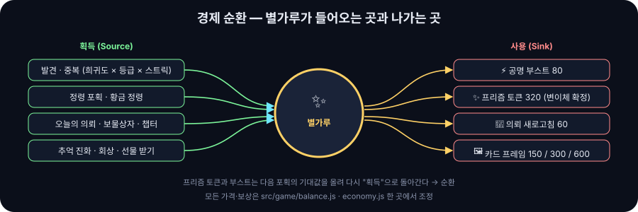</p>

| Spend on | Price | Effect |
|---|:--:|---|
| ⚡ Resonance boost | 80 | Next resonance fills 2× faster (hold up to 3) |
| ✨ Prism token | 320 | Next capture is a guaranteed Variant (also from the 3rd quest, Golden spirits, and treasure chests) |
| 🔁 Quest refresh | 60 | Swap one unfinished quest |
| 🖼️ Card frames | 150 / 300 / 600 | Aurora · Ember · Void — applied to cards, the Album, and collages |

**Treasure chests**: Stardust · Prism · XP at every 5 · 10 · 20 · 40 · 60 · 80 Wonders collected. **Goal ladder**: the title always shows the 4 nearest achievements and their rewards.

## 📸 Memories — not photos you take and forget

<p align="center">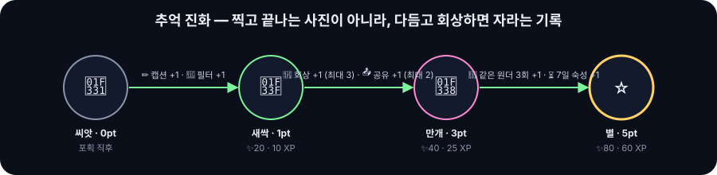</p>

| Feature | Description |
|---|---|
| **Album** | Every capture stores a photo (640px · ≈50KB) and a **capture clip** (540p · 5 s · with sound · ≈700KB) in IndexedDB. 160MB cap; the oldest non-favorites are cleaned up first |
| **Evolution** | 🌱 Seed → 🌿 Sprout → 🌸 Bloom → ⭐ Star. Captions, filters, Recall, sharing, revisits and 7-day aging earn points. Each stage pays Stardust and XP |
| **Recall** | Once a day, "your memory from N days ago" surfaces on the title. Open it and it grows, +10 Stardust |
| **Polish** | 60-character caption · 5 light filters (Sunset · Dawn · Memory · Dream) · frames |
| **Duel** | Two memories battle over 3 rounds: Mystery, Timing, Growth. The shadow opponent is an "other-world version" of your own memory. Winning pays Stardust and both sides grow |
| **Share** | Card PNG · clip file · 9-photo collage · 🎁 **gift code** (no server: your friend gets Stardust, your memory, and a hint) |

## 🧪 Lens skills — abilities for polishing your photos

<p align="center">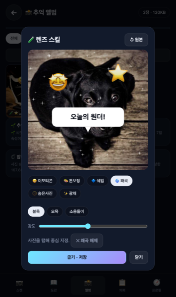</p>

| Skill | Unlock | What it does | Growth |
|---|:--:|---|---|
| 😄 Emoji | Lv1 | Tap to place 20 emoji and drag them around | +1 pt for using at least 1 skill |
| 🎨 Tone | Lv2 · ✨120 | Brightness · contrast · saturation · temperature sliders + 4 presets | |
| 🔷 Shapes | Lv3 · ✨180 | Spotlight · speech bubble (text) · star burst · polaroid · rainbow border | |
| 🌀 Warp | Lv4 · ✨240 | Bulge · pinch · swirl centered where you tap (pixel inverse mapping) | +1 more pt for 3+ skills |
| 🫥 Hidden photo | Lv5 · ✨300 | Hide a small emoji at a random spot → a **10-second hidden-object hunt** on Recall (✨15) · cover the photo (scratch to see) | |
| ✨ Glow | Lv6 · ✨200 | Vignette + sparkle particles | |

Edits are **baked** into the 640px photo while the original is kept separately (↺ Original). Cards, collages and the Plaza use the baked result.

## 👁 Eye Gauge — capture with your eyes (replaces gestures)

Hand gestures and facial-expression controls were **removed** and replaced with a single gaze tracker. On the front camera, MediaPipe FaceLandmarker computes a **gaze point** from eye direction and head pose, and Lupe's eye on screen (the reticle) follows it.

| Target | Condition | Look for | Result |
|---|---|:--:|---|
| Wonder (when the capture ring is up) | Gaze point inside the object box (20% margin, min 44px) | 0.9 s | Capture. Shake ≤ 8px = **Perfect**, ≤ 18px = **Great**, otherwise Good |
| Spirit | Within 60px of the gaze point | 0.6 s | Spirit captured (Golden spirits give a Prism token) |
| No face · eyes closed | — | — | The gauge drops 1.5/s and shows "Can't see your face" |

| Control | How |
|---|---|
| On/off | **Long-press** the eye badge at the bottom-left of the scan screen, or Profile → Settings |
| Calibrate | Look at the center of the screen and **tap** the eye badge (reset in Profile) |
| Rear camera · photo scan | The eye hides; tap-only |

When it fires you get an eyelid blink, 2 shock rings, 12 sparks, a brass edge flash and haptics (with Reduce motion: text and haptics only). The face model is downloaded from a CDN on first use.

#### 🎯 Recognition and precision (v8.2)

Gaze naturally wobbles, and people blink every 3–5 seconds. Left alone, the 0.9 s hold keeps breaking. So the gauge rules gained four additions.

| Mechanism | Meaning | Value |
|---|---|---|
| **Blink grace** | Keeps the reticle and gauge in place during a brief eye closure | 300ms |
| **Switch grace** | A brief gaze jump (saccade) doesn't reset the gauge to 0 | 150ms |
| **Wider hold box** | A target you already hold is judged with a 35% larger box (20% when first acquiring) | hysteresis |
| **One Euro filter** | Suppresses jitter when you look steadily, follows immediately on large moves | minCutoff 0.6 · β 0.007 |
| Inference rate | Face model 20Hz (was 15Hz) | 50ms |
| Detection continuity | An already-locked object stays tracked with detections 0.15 lower in confidence (new locks use the normal threshold) | `BALANCE.detect` |

Pure state-machine verification run in Node (`npm test`, v8.1 → v8.2):

| Scenario | v8.1 | v8.2 |
|---|:--:|:--:|
| First fire after a 0.1 s saccade | 1450ms | **1017ms** |
| Reticle jitter per frame with 12px input jitter | 1.03px | **0.94px** |
| Time to reach 90% after a 300px jump | 267ms | **33ms** |
| Two blinks during a hold | fires | fires (gauge frozen) |
| Grades at 7 / 9 / 17 / 19px jitter | P / G / G / GOOD | P / G / G / GOOD |

### 📸 Shutter bar — only 4 buttons

| Button | Action |
|---|---|
| Home | Back to the title |
| Photo | Scan a gallery photo (when there's no camera or it was denied) |
| **Shutter (center, 78px)** | **Tap = photo** (works even without a Wonder · best photo picked automatically · Album `Photo` filter) · **Hold 0.5 s = start/stop video** (up to 20 s, Album `Video` filter) |
| Flip | Front/rear camera (the Eye Gauge turns on with the front camera) |

> **First launch on mobile**: the camera permission prompt appears when you tap **Start!** in the lens tutorial. While the prompt is open the browser blocks touches on the page, so tap **Allow** to continue. If you deny it you can keep playing with photo scans.

## 📍 Nearby spots — recommendations by location (opt-in)

"Go to a nearby café and you'll find Kitchen Wonders; go to a park and Spirits appear twice as often." Your location is asked **only when you tap "Find nearby spots"**, and only coordinates rounded to ~100 m are stored on the device for 1 hour. Camera frames still never leave the device.

| Where | Chapter | Wonders to shoot here | Boost event (30 min) |
|---|---|---|---|
| Café · bakery | Kitchen Alchemy | cup · cake · donut | **Coffee Time** — Kitchen Wonders Stardust ×2 |
| Park · playground | Shards of Play · Living Mysteries | frisbee · kite · ball · dog | **Stroll** — Spirit spawns ×2 |
| Station · stop | Street Giants | bus · train · traffic light | **Street Giants** — Resonance +50% |
| Library · bookstore | The Desk Cosmos | book · laptop · clock | **Close Reading** — Desk Wonders Stardust ×2 |
| Supermarket · mall | Everyday Relics · Kitchen | handbag · bottle · banana | **Shopping Run** — 3-Wonder spot challenge → ✨100 |

- Place data: **Google Places API (New)** when `VITE_GOOGLE_MAPS_KEY` is set, otherwise **OpenStreetMap Nominatim** (no key, sequential requests 1 s apart).
- **Around your current position (v8.3)**: up to 40 results per category, sorted **by distance**; categories with nothing within 800 m are retried within 2 km. Distances and bearings use your live (unrounded) position; only the ~100 m-rounded coordinates are stored, for 1 hour.
- **Moves with you**: moving more than 250 m from the cached point triggers a new search; otherwise only the distances are recomputed from where you are. If location permission was already granted, the title and spots screens refresh silently, with no prompt.
- Results appear progressively as each category arrives, and the header shows location accuracy (±m). Measured: nearest café at Gangnam Station 71 m (244 m in v8.2), 5 place types around Dongtan.
- Entry points: the "Nearby spots" card on the title, the top of the Quests screen, and Profile → Settings "Location-based recommendations" (turns on auto-refresh).
- Each card shows distance and bearing (`320m · NE`), the chapter emblem, 3 Wonders, "Open map" (Google Maps link, no key needed) and "Open camera".

## 🌐 Social — collecting, not alone

| Stage | What you get | Requires |
|---|---|---|
| Now | Show Wonders with gift codes, share cards · clips · collages | Nothing |
| With cloud on | **Google sign-in** → memories saved to your account, continue across devices, browse other collectors' memories in the **Explorer Plaza** | 5 Firebase keys ([docs/CLOUD_SETUP.md](docs/CLOUD_SETUP.md)) |

## 🔮 Lupe — the guide who follows you

| Role | Examples |
|---|---|
| **Advice** (reads your state and picks by priority) | "You have 2 Prism tokens — equip one when you see something rare" · "2 more to a treasure chest!" · "It's night, turn on just one lamp" · "Kitchen Wonders show up well at lunchtime" |
| **Events** (one a day, date-seeded) | ⚡ Wonder Storm (chapter Stardust ×2) · Spirit Migration (spirits ×2) · Clear Lens (resonance +50%) · Lupe's Request (bring back a specific Wonder) · Shadow Challenge (duel victory reward) |
| **Companion** | Tap the avatar at the bottom-right of the scan screen for a tip about right now; a red dot means a new event |

## 🎆 Staging

| Moment | Effect |
|---|---|
| Lock | Four viewfinder brackets **converge** from the screen corners onto the object (120ms) — "got it" |
| Resonating | **Tracked silhouette**: an engraved outline around the object is drawn as resonance rises (corner ticks at 25·50·75·100%), leaving an afterimage trail. **Tracking shade**: the object is lit, the surroundings slightly darkened. **Aura**: a per-chapter energy (ember · verdigris mist · orbit · ink bleed · prism) grows with the gauge. The tag reads `cup · confidence 87% · resonance 62%` |
| Lost | The last silhouette lingers 1.5 s as a dotted afterimage ("Lost · aim again") |
| Capture ring | 40% spotlight outside the object, pulse rings at 50% and 100% resonance |
| Perfect / Great | 90ms freeze frame + zoom punch (1.06 / 1.03) + 16 / 8 brass speed lines + silhouette stamp |
| Miss | The silhouette flees off-screen leaving 3 afterimages |
| Best photo | Among up to 8 frames between 60% resonance and capture, the sharpest × most confident × most centered shot becomes the card photo. Swap it from the "Other shots" strip on the reveal screen. A shutter tap also takes the sharpest frame of the last 0.4 s |
| Discovery (all grades) | Screen flash → 3D card flip → stamp (NEW! / ×n) → particles → **scratch** to reveal the Wonder name and the real label |
| Epic+ suspense | Drum roll + pulsing orb + "?" → revealed after 1.4 s |
| Combo | "🔥 N COMBO" + rising tone for consecutive Perfect/Great |
| Treasure chest | Chest opens + star particles on reaching a milestone |
| Duel | Arena shake → per-round hit shake and HP drain → the winner glows |
| Epic+ | Glitch + screen shake + slow-motion entrance |
| Legendary · Variant | Rotating halo (rays) + star-shaped particle rain + low drone sound + haptics |
| Rank up / chapter complete | Toast + extra particles + story card |

Sound is **synthesized with Web Audio** — no assets, zero loading cost. Mute it at the top-right of the title.

---

## 🧠 Architecture — all inside the browser

<p align="center">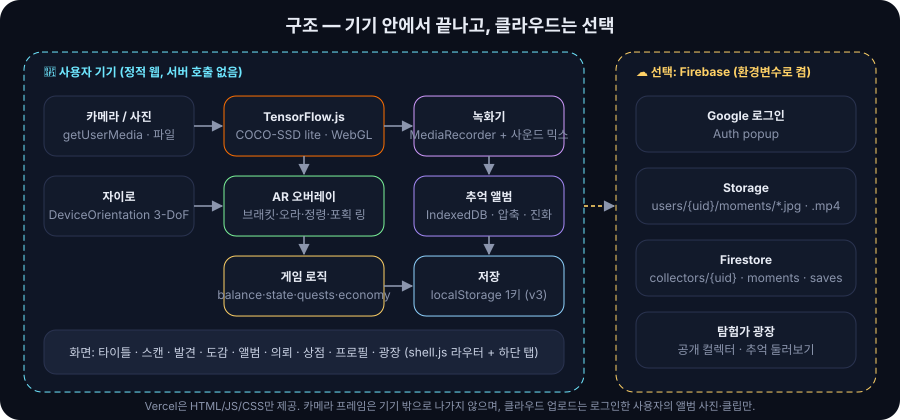</p>

- **Privacy**: camera frames never leave the device. Only your codex progress is stored (locally).
- **Offline**: once the model (about 5MB) is loaded, recognition works without a network.

```
src/
├─ data/      wonders.js (80) · chapters.js (6 chapters) · worlds/ (world registry)
├─ game/      balance.js · state.js (v3) · capture.js · quests.js · achievements.js · notes.js · narrative.js
│             economy.js · media.js · memories.js · duel.js · companion.js · skills.js (edit-skill engine: warp · tone · shapes · emoji · hide · glow)
├─ scanner/   detector.js · camera.js · gyro.js · recorder.js · gaze.js (FaceLandmarker gaze) · eye.js (Eye Gauge state machine)
├─ ar/        overlay.js · spirits.js
├─ geo/       provider.js · nominatim.js · google.js · osm.js (nearby spots)
├─ i18n/      index.js (runtime KO/EN layer) · en.js (English dictionary, lazy-loaded)
├─ cloud/     provider.js (adapter) · firebase.js (dynamic import, excluded from the bundle without keys)
├─ ui/        shell.js · fx.js · card.js · scratch.js · editor.js (skill editor) · screens/ (title · scan · reveal · codex · album · quests · shop · profile · collectors · duel · spots)
└─ main.js
public/img/   lupe.svg (mascot) · logo.svg · ch/*.svg (chapter emblems) — hand-drawn vectors
```

---

## 🌐 Language — English / 한국어

| Item | Behavior |
|---|---|
| First visit | Follows the browser language (Korean → Korean, anything else → English) · `?lang=en` / `?lang=ko` in the URL also works |
| Switch | The **EN / 한** button at the top-right of the title, or Profile → Settings → **Language** |
| Saved | On the device (localStorage) · game progress and saves are independent of the language |
| Never translated | User content (captions, explorer names) and place names |

How it works: the Korean source strings stay as they are; only in English mode is a dictionary (`src/i18n/en.js`, lazy-loaded, 37KB gzip) used to swap on-screen text, attributes, canvas text and dialogs. `npm run i18n:check` lists new Korean strings that still need a translation.

## 🚀 Run and deploy

```bash
npm install
npm run dev        # http://localhost:5173  (the camera only works on localhost or HTTPS)
npm test           # eye-gauge precision · geo · i18n
npm run build      # dist/
vercel --prod      # static deploy
```

| Item | Value |
|---|---|
| Live | https://wonderscanner.vercel.app |
| Stack | Vite 7 · Vanilla JS · TensorFlow.js 4 · COCO-SSD · MediaPipe Tasks Vision (gaze tracking, lazy-loaded) · canvas-confetti · Web Audio · DeviceOrientation |
| Data | localStorage `wonder-scanner:v1` (schema v3) + IndexedDB `wonder-album` · optional: Firebase |
| Supported | iOS Safari / Android Chrome (camera), desktop browsers (photo upload) |

---

## ❓ FAQ

- **It doesn't recognize anything.** Make the object about half the screen and point at it in good light. Only confidence ≥ 50% counts.
- **Why are people Wonders too?** `person` is one of the 80 COCO classes, and in the story the "two-legged question generator" is the only species that discovers Wonders.
- **I want to delete my data.** Profile → Settings → **Reset**.
- **The effects are too much.** Profile → Settings → **Reduce motion** (removes shake, glitch and flashes), **Auto-capture** (skips the timing ring).

---

## 📚 Docs

- [`README.ko.md`](README.ko.md) — 한국어 README
- [`HISTORY.md`](HISTORY.md) — Sprint 1 (4-hour MVP) + Sprint 2 (AR · content · polish) log
- [`docs/PRD.md`](docs/PRD.md) — product requirements (personas · feature table · metrics · world expansion · roadmap)
- [`docs/CLOUD_SETUP.md`](docs/CLOUD_SETUP.md) — how to enable Google sign-in · per-user storage · the Plaza
- [`docs/game-feel-contract.json`](docs/game-feel-contract.json) — the game-feel contract for the capture moment
- [`DESIGN.md`](DESIGN.md) — design system "Brass-Lens Expedition Journal" (color · type · components · mobile-game principles)
- [`docs/GAMEPLAY_V7.md`](docs/GAMEPLAY_V7.md) — tracked silhouette · action staging · aura skins · Eye Gauge (gaze) · camera-first · location recommendation spec
- [`docs/vfx/aura-tracking.json`](docs/vfx/aura-tracking.json) · [`docs/vfx/eye-impact.json`](docs/vfx/eye-impact.json) — staging contracts that pass the game-vfx validator
- [`docs/qa/`](docs/qa/) — precision QA records (`tests/eye-precision.mjs` = `npm test`)
- Origin: Gemini brainstorm "AI Magic Lens: rediscovering the everyday" (idea #3), expanded around game systems, balance, story, core loop and staging

<div align="center"><sub>Sprint 1 (4h MVP) → Sprint 8 (AR · memories · social · NPC · skills · Eye Gauge · location · precision · i18n (KO/EN)) · 2026-09-24</sub></div>
