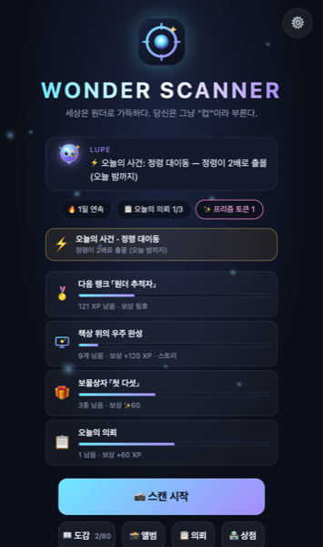
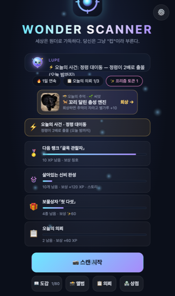
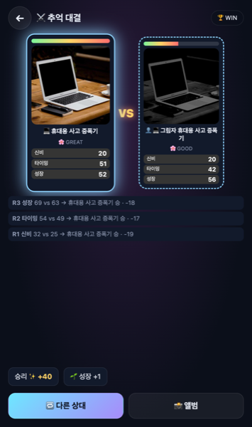
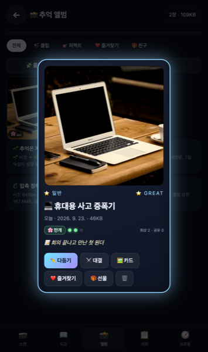
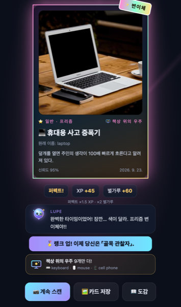
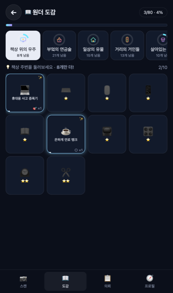
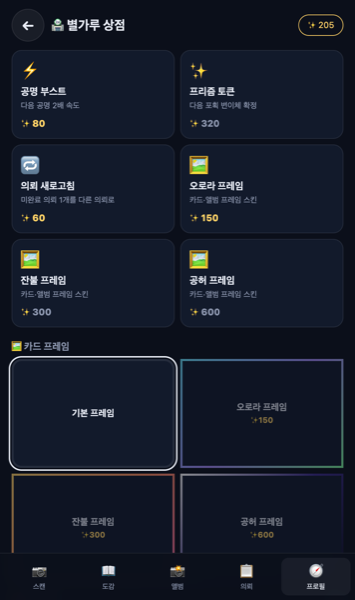
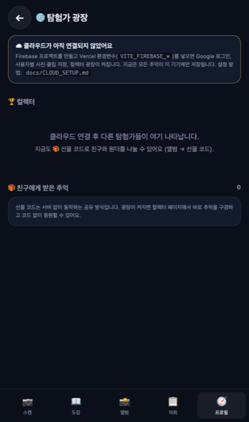

<div align="center">

# 🔭 WONDER SCANNER

**세상은 원더로 가득하다. 당신은 그냥 "컵"이라 부른다.**

카메라로 주변 물건을 비추면, 그 물건의 *진짜 모습*(원더)이 드러나는 **수집형 도감 게임**입니다.
AI는 100% 브라우저 안에서만 돌아갑니다. 사진은 어디로도 전송되지 않습니다.

[](https://wonderscanner.vercel.app)


<sub>스마트폰 카메라로 QR을 찍으면 바로 시작됩니다 (카메라 권한 필요)</sub>

<br/>

| 타이틀 · 목표 사다리 · 사건 | 스크래치 발견 | 추억 대결 | 추억 앨범 · 진화 |
|:--:|:--:|:--:|:--:|
|  |  |  |  |
| **퍼펙트 → 변이체** | **도감** | **별가루 상점** | **탐험가 광장** |
|  |  |  |  |

</div>

---

## 🧒 이게 뭐예요? (ELI5)

> **다섯 살에게 설명하면:**
> 마법 망원경이 있어요. 컵을 들여다보면 "이건 사실 우주선 연료 탱크야!"라고 알려줘요.
> 그렇게 찾은 것들을 스티커북에 붙여요. 스티커북을 다 채우면 마법사가 비밀 이야기를 들려줘요.

| ELI5 용어 | 게임 안에서의 뜻 | 실제로는 |
|---|---|---|
| **원더 (Wonder)** | 평범한 물건의 "진짜 모습" | AI가 인식한 사물 80종 각각에 붙인 재해석 이름 + 한 줄 설정 |
| **렌즈** | 원더를 보여주는 마법 망원경 | 스마트폰 카메라 + 브라우저 안의 사물 인식 AI |
| **공명 (Resonance)** | 렌즈를 가만히 대고 있으면 차오르는 빛 | AI가 같은 물체를 연속으로 인식하는 동안 채워지는 게이지 |
| **도감 (Codex)** | 스티커북 | 발견한 원더 80칸짜리 컬렉션 (기기에 저장) |
| **별가루** | 이미 있는 스티커를 또 뽑았을 때 받는 사탕 | 중복 발견 시 지급되는 자원, 랭크 XP로 이어짐 |
| **변이체 (프리즘)** | 반짝이는 희귀 스티커 | 약 4~10% 확률의 특별 색상 버전 (보상 3배) |
| **챕터** | 스티커북의 페이지 | 장소별 6개 테마 세트 (책상·부엌·집·거리·생물·놀이) |
| **루페 (Lupe)** | 렌즈 속에 사는 마법사 친구 | 상황별 대사와 스토리를 들려주는 안내 캐릭터 |
| **랭크** | 탐험가 배지 | XP 누적에 따라 열리는 10단계 칭호 |

---

## 🎮 어떻게 노나요?

<p align="center"></p>

1. **스캔 시작**을 누르고 카메라 권한을 허용합니다.
2. 컵, 노트북, 의자… 아무 물건이든 화면 가운데에 두세요. 물체에 **브래킷과 오라**가 생기고 **공명 링**이 차오릅니다.
3. 링이 꽉 차면 **줄어드는 포획 링**이 나타납니다. 노란 선에 닿는 순간 **탭!**
   - 🎯 **퍼펙트** = XP ×1.5 · 별가루 ×2 · 변이체 확률 ×3 / ⭐ 그레이트 / ○ 굿 / ✖ 미스 = 원더가 도망, 공명 다시 채우기
4. 화면을 떠다니는 **정령**을 탭하면 조각(◇)을 얻습니다. 5개 = 다음 공명 2배 속도. 가끔 나오는 **황금 정령**은 프리즘 토큰을 줍니다.
5. 카드는 **PNG로 저장/공유**할 수 있습니다. 카메라가 없는 PC에서는 **사진 파일**로 같은 흐름을 즐길 수 있습니다.

### 🧭 AR 요소 (WebXR 없이, 2D 캔버스 + 자이로)

| 요소 | 동작 |
|---|---|
| **스무딩 브래킷 + 홀로 태그** | AI 박스를 보간해 떨림을 없애고, 물체 위에 떠서 살랑이는 라벨을 붙입니다 |
| **오라 파티클** | 공명이 찰수록 물체 주위를 도는 입자가 늘어납니다 (희귀도 색) |
| **정령 (Spirits)** | 자이로 요/피치에 앵커돼 폰을 돌리면 시야 밖에서 나타나고, 탭하면 터집니다. 인식된 물체 쪽으로 끌립니다 |
| **포획 링** | Pokémon GO의 서클 타이밍처럼 줄어드는 링을 노란 선에 맞춰 탭 |
| **나침반 힌트** | 완성에 가장 가까운 챕터와 미수집 원더를 HUD에 띄워 "2개만 더!"를 유도 |

---

## ⚖️ 밸런스 설계

### 희귀도 — "얼마나 자주 마주치는가"로 배분

| 희귀도 | 수 | 예시 | 어디서 |
|:--:|:--:|---|---|
| ⭐ 일반 | 24 | 컵·노트북·의자·병 | 책상·부엌·집 |
| ⭐⭐ 희귀 | 26 | 시계·자전거·고양이·바나나 | 거리·반려동물·과일 |
| ⭐⭐⭐ 영웅 | 20 | 피자·소화전·기차·연 | 외출·놀이 |
| ⭐⭐⭐⭐ 전설 | 10 | 비행기·기린·서핑보드·스키 | 여행·동물원·바다 |

### 보상표

| 희귀도 | 첫 발견 XP | 첫 발견 별가루 | 중복 XP | 중복 별가루 |
|:--:|:--:|:--:|:--:|:--:|
| ⭐ 일반 | 20 | 10 | 4 | 3 |
| ⭐⭐ 희귀 | 40 | 20 | 8 | 6 |
| ⭐⭐⭐ 영웅 | 80 | 40 | 14 | 12 |
| ⭐⭐⭐⭐ 전설 | 160 | 80 | 25 | 24 |

- **변이체**: 별가루 ×3, XP ×1.5. 확률 = 4% + (신뢰도 − 0.5) × 12% → 잘 비출수록 최대 10%.
- **공명 속도**: AI 신뢰도가 높을수록 빨리 찹니다. 기준 약 2.2초. 놓치면 빠르게 감소합니다.
- **쿨다운 15초**: 같은 물건 연타 파밍을 막습니다. 다른 물건을 찾게 유도합니다.
- **챕터 완성 보너스**: +120 XP와 루페의 스토리 조각.
- **랭크 10단계**: 견습 탐험가(0) → 렌즈 수습생(50) → 골목 관찰자(150) → … → 원더 마스터(4600).
- **포획 등급**: 링 반경과 목표(0.30)의 거리로 판정. 퍼펙트 ≤0.045, 그레이트 ≤0.10, 굿 ≤0.17, 그 밖은 미스(게이지 35%로 복귀). 3사이클 무입력 = 자동 포획.
- **오늘의 의뢰 3개** (날짜 시드): 챕터 신규 2종 / 스캔 5회 / 희귀 이상 1종 / 정령 8마리 / 퍼펙트 2회 중 조합. 3번째 의뢰 = **프리즘 토큰**(다음 포획 변이체 확정).
- **연속 출석**: 하루 +10% XP, 최대 +50%.
- **도감 깊이**: 같은 원더 3회 → 루페의 관찰 노트, 10회 → 마스터 노트 + 금색 프레임.
- **업적 15종**: 첫 원더 · 전설 목격 · 퍼펙트 10회 · 황금 정령 · 3일 연속 등.

모든 숫자는 [`src/game/balance.js`](src/game/balance.js) 한 파일에 있습니다.

---

## 📜 서사 — 루페와 여섯 개의 챕터

당신은 **원더 탐험가**. 렌즈 속에 사는 안내 AI **루페(Lupe)** 가 발견마다 반응하고,
챕터를 완성할 때마다 원더 세계의 비밀을 한 조각 들려줍니다. 80종을 모두 모으면 엔딩 대사가 열립니다.

| 챕터 | 장소 힌트 | 원더 수 | 대표 원더 |
|---|---|:--:|---|
| 🖥️ 책상 위의 우주 | 책상 주변 | 10 | 컵 → *은하계 연료 탱크* |
| 🍳 부엌의 연금술 | 냉장고·식탁 | 21 | 냉장고 → *시간 정지 금고* |
| 🏠 일상의 유물 | 거실·침실·현관 | 15 | 소파 → *집 안의 늪* |
| 🚦 거리의 거인들 | 밖으로 | 13 | 소화전 → *도로변 물의 봉인탑* |
| 🐾 살아있는 신비 | 사람·동물 | 11 | 고양이 → *액체 상태의 군주* |
| 🎈 놀이의 파편 | 공원·바다·산 | 10 | 연 → *실에 묶인 작은 하늘 배* |

---

## 💫 경제 순환 — 별가루는 어디서 오고 어디로 가나

<p align="center"></p>

| 사용처 | 가격 | 효과 |
|---|:--:|---|
| ⚡ 공명 부스트 | 80 | 다음 공명 2배 속도 (최대 3개 보유) |
| ✨ 프리즘 토큰 | 320 | 다음 포획 변이체 확정 (3번째 의뢰·황금 정령·보물상자로도 획득) |
| 🔁 의뢰 새로고침 | 60 | 미완료 의뢰 1개 교체 |
| 🖼️ 카드 프레임 | 150 / 300 / 600 | 오로라 · 잔불 · 공허 — 카드·앨범·콜라주에 적용 |

**보물상자**: 5 · 10 · 20 · 40 · 60 · 80종 수집마다 별가루·프리즘·XP. **목표 사다리**: 타이틀에 가장 가까운 성취 4개와 보상을 항상 보여줍니다.

## 📸 추억 — 찍고 끝나는 사진이 아니다

<p align="center"></p>

| 기능 | 설명 |
|---|---|
| **앨범** | 포획마다 사진(640px·≈50KB)과 **포획 클립**(540p·5초·사운드 포함·≈700KB)이 IndexedDB에 저장. 상한 160MB, 즐겨찾기 아닌 오래된 것부터 정리 |
| **진화** | 🌱씨앗 → 🌿새싹 → 🌸만개 → ⭐별. 캡션·필터·회상·공유·재방문·7일 숙성이 포인트. 단계마다 별가루·XP |
| **회상** | 하루 한 번 타이틀에 "N일 전의 추억"이 떠오릅니다. 열어보면 자라고 별가루 +10 |
| **다듬기** | 캡션 60자 · 빛 필터 5종(노을·새벽·기억·꿈결) · 프레임 |
| **대결** | 두 추억이 신비·타이밍·성장 3라운드로 싸웁니다. 그림자 상대는 내 추억의 "다른 세계 버전". 승리 별가루 + 양쪽 모두 성장 |
| **공유** | 카드 PNG · 클립 파일 · 9장 콜라주 · 🎁 **선물 코드**(서버 없음: 친구는 별가루·친구 추억·힌트를 받음) |

## 🧪 렌즈 스킬 — 사진을 다듬는 능력

<p align="center"></p>

| 스킬 | 해금 | 하는 일 | 성장 |
|---|:--:|---|---|
| 😄 이모티콘 | Lv1 | 이모지 20종을 탭해서 붙이고 드래그로 옮김 | 스킬 1종 이상 사용 +1pt |
| 🎨 톤보정 | Lv2 · ✨120 | 밝기·대비·채도·온도 슬라이더 + 프리셋 4 | |
| 🔷 쉐입 | Lv3 · ✨180 | 스포트라이트 · 말풍선(문구) · 별 버스트 · 폴라로이드 · 무지개 테두리 | |
| 🌀 왜곡 | Lv4 · ✨240 | 볼록 · 오목 · 소용돌이, 탭한 곳이 중심 (픽셀 역매핑) | 스킬 3종 이상 +1pt 추가 |
| 🫥 숨은사진 | Lv5 · ✨300 | 작은 이모지를 랜덤 위치에 숨김 → 회상 때 **10초 숨은 그림 찾기**(✨15) · 사진 가리기(스크래치로 보기) | |
| ✨ 광채 | Lv6 · ✨200 | 비네트 + 반짝이 입자 | |

편집은 640px 사진에 **구워져(bake)** 저장되고 원본은 따로 보존됩니다(↺ 원본). 카드·콜라주·광장에는 구운 결과가 그대로 쓰입니다.

## 🖐 제스처 — 손과 얼굴로 조작

스캔 화면의 **🖐 제스처** 칩을 켜면 MediaPipe 손 인식(+선택: 얼굴 블렌드셰이프)이 기기에서 돌아갑니다. 모델은 첫 사용 시 CDN에서 받고, 추론은 100ms 간격으로 카메라 인식과 병행됩니다.

| 손 | 동작 | 얼굴 (전면 카메라 권장) | 동작 |
|:--:|---|:--:|---|
| ✌️ 브이 | 포획 링 탭 | 😉 두 번 깜빡 | 포획 링 탭 |
| ✊ 주먹 | 손끝 근처 정령 포획 | 😮 입 벌리기 | 정령 흡입 (최대 3) |
| 🖐 손바닥 | 자유 영상 촬영 시작/정지 (최대 20초, 앨범 저장) | 🤨 눈썹 올리기 | 프리즘 토큰 장착 |
| 👍 따봉 | 프리즘 토큰 장착 | 😄 미소 | 스냅 (사진 즉시 저장) |
| 🤟 아이러브유 | 스냅 | | |
| ☝️ 포인팅 | 손끝 포인터 표시 | | |

제스처는 350ms 이상 유지될 때 1회 발동하고, 화면 좌하단 HUD에 인식된 제스처가 표시됩니다. 접근성: 모든 제스처 동작은 버튼/탭으로도 가능하며 설정에서 끌 수 있습니다.

## 🌐 소셜 — 혼자가 아닌 수집

| 단계 | 동작 | 필요한 것 |
|---|---|---|
| 지금 | 선물 코드로 원더 보여주기, 카드·클립·콜라주 공유 | 없음 |
| 클라우드 켜면 | **Google 로그인** → 추억이 내 계정에 저장, 기기 간 이어하기, **탐험가 광장**에서 다른 컬렉터의 추억 둘러보기 | Firebase 키 5개 ([docs/CLOUD_SETUP.md](docs/CLOUD_SETUP.md)) |

## 🔮 루페 — 따라다니는 안내자

| 역할 | 예 |
|---|---|
| **조언** (상태를 읽고 우선순위로 고름) | "프리즘 토큰이 2개 있어, 희귀한 게 보이면 장착하자" · "보물상자까지 2종!" · "밤이네, 램프 하나만 켜 줘" · "점심시간엔 부엌 원더가 잘 보여" |
| **사건** (하루 1개, 날짜 시드) | ⚡ 원더 폭풍(챕터 별가루 2배) · 정령 대이동(정령 2배) · 맑은 렌즈(공명 +50%) · 루페의 부탁(특정 원더 찍어오기) · 그림자 도전장(대결 승리 보상) |
| **동행** | 스캔 화면 우하단 아바타를 탭하면 지금 상황의 팁, 빨간 점은 새 사건 |

## 🎆 연출

| 순간 | 연출 |
|---|---|
| 공명 중 | 희귀도 색 브래킷, 빛나는 링, 게이지에 따라 빨라지는 틱 사운드, 스캔 라인 |
| 발견 (모든 등급) | 화면 플래시 → 카드 3D 플립 → 스탬프(NEW! / ×n) → 파티클 → **스크래치**로 세계관 이름·실제 라벨 긁어서 확인 |
| 영웅 이상 서스펜스 | 드럼롤 + 맥동하는 오브 + "?" → 1.4초 뒤 공개 |
| 콤보 | 퍼펙트/그레이트 연속 시 "🔥 N COMBO" + 상승 톤 |
| 보물상자 | 마일스톤 도달 시 상자 열림 + 별 파티클 |
| 대결 | 아레나 진동 → 라운드별 피격 흔들림·HP 감소 → 승자 발광 |
| 영웅 이상 | 글리치 + 화면 흔들림 + 슬로모션 진입 |
| 전설 · 변이체 | 회전 후광(rays) + 별 모양 파티클 비 + 저음 드론 사운드 + 햅틱 |
| 랭크 업 / 챕터 완성 | 토스트 + 추가 파티클 + 스토리 카드 |

사운드는 에셋 없이 **Web Audio 합성**으로 만들어 로딩 비용이 0입니다. 타이틀 우상단에서 끌 수 있습니다.

---

## 🧠 구조 — 전부 브라우저 안에서

<p align="center"></p>

- **개인정보**: 카메라 프레임은 기기 밖으로 나가지 않습니다. 저장되는 것은 도감 진행 상황(로컬)뿐입니다.
- **오프라인**: 모델(약 5MB)이 한 번 로드되면 인식은 네트워크 없이 동작합니다.

```
src/
├─ data/      wonders.js(80종) · chapters.js(6챕터) · worlds/(세계관 레지스트리)
├─ game/      balance.js · state.js(v3) · capture.js · quests.js · achievements.js · notes.js · narrative.js
│             economy.js · media.js · memories.js · duel.js · companion.js · skills.js(편집 스킬 엔진: 왜곡·톤·쉐입·이모지·숨김·광채)
├─ scanner/   detector.js · camera.js · gyro.js · recorder.js · gesture.js(MediaPipe 손·얼굴, 동적 import)
├─ ar/        overlay.js · spirits.js
├─ cloud/     provider.js(어댑터) · firebase.js(동적 import, 키 없으면 번들 제외)
├─ ui/        shell.js · fx.js · card.js · scratch.js · editor.js(스킬 에디터) · screens/(title·scan·reveal·codex·album·quests·shop·profile·collectors·duel)
└─ main.js
public/img/   lupe.svg(마스코트) · logo.svg · ch/*.svg(챕터 엠블럼) — 손으로 그린 벡터
```

---

## 🚀 실행과 배포

```bash
npm install
npm run dev        # http://localhost:5173  (카메라는 localhost 또는 HTTPS에서만)
npm run build      # dist/
vercel --prod      # 정적 배포
```

| 항목 | 값 |
|---|---|
| 라이브 | https://wonderscanner.vercel.app |
| 스택 | Vite 7 · Vanilla JS · TensorFlow.js 4 · COCO-SSD · MediaPipe Tasks Vision(제스처·얼굴, 지연 로드) · canvas-confetti · Web Audio · DeviceOrientation |
| 데이터 | localStorage `wonder-scanner:v1` (스키마 v3) + IndexedDB `wonder-album` · 선택: Firebase |
| 지원 | iOS Safari / Android Chrome (카메라), 데스크톱 브라우저 (사진 업로드) |

---

## ❓ 자주 묻는 것

- **인식이 안 돼요.** 물체를 화면의 절반 정도 크기로, 밝은 곳에서 비춰 보세요. 신뢰도 50% 이상만 인식합니다.
- **왜 사람도 원더인가요?** COCO 80종에 `person`이 포함되어 있고, "두 발로 걷는 질문 생성기"는 서사상 원더를 발견하는 유일한 종입니다.
- **데이터를 지우고 싶어요.** 프로필 → 설정 → **초기화**.
- **화면 효과가 부담돼요.** 프로필 → 설정 → **모션 줄이기** (흔들림·글리치·플래시 제거), **자동 포획** (타이밍 링 생략).

---

## 📚 문서

- [`HISTORY.md`](HISTORY.md) — 스프린트 1(4시간 MVP) + 스프린트 2(AR·콘텐츠·폴리싱) 기록
- [`docs/PRD.md`](docs/PRD.md) — 제품 요구사항 (페르소나 · 기능표 · 지표 · 세계관 확장 · 로드맵)
- [`docs/CLOUD_SETUP.md`](docs/CLOUD_SETUP.md) — Google 로그인 · 사용자별 저장 · 광장 켜는 법
- [`docs/game-feel-contract.json`](docs/game-feel-contract.json) — 포획 순간의 게임 필 계약
- 원안: Gemini 브레인스토밍 "AI 매직 렌즈: 일상의 놀라운 재발견" (아이디어 3번)을 게임 요소·밸런스·서사·코어루프·연출 중심으로 확장

<div align="center"><sub>Sprint 1 (4h MVP) → Sprint 6 (AR · 추억 · 소셜 · NPC · 스킬 · 제스처) · 2026-09-23</sub></div>
